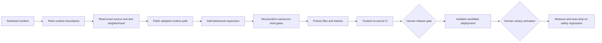

# Upgrade architecture

For a production-system-design tutorial and a component-by-component assessment of
this architecture, see [Production Agentic AI System Design](TEACHING_AGENTIC_SYSTEM_DESIGN.md).

## Request lifecycle

1. A deterministic statement analyzer runs for every request. It extracts explicit
   services, delivery channels, recipients, temporal expressions, composition intent,
   and current-turn write authority before classification or planning.
2. Previous messages are not appended unconditionally. A relevance gate projects only
   the bounded session facts needed to resolve anaphora or omitted context; the current
   turn remains the authority for every executable service and external write. Prior
   output can supply referenced content (for example, “send the paragraph above”) but
   nouns inside that output cannot introduce Calendar, Meet, Chat, Gmail, or other
   steps.
3. A guarded router separates Workspace actions, Workspace-scoped product questions,
   and bounded creation/transformation (drafts, applications, essays, roadmaps,
   translations, conversations, summaries, and pointers). Bounded composition may
   finish before the user chooses a Workspace destination; unrestricted factual
   open-domain chat remains outside the product boundary.
4. `POST /runs` creates a tenant-scoped, idempotent run and a validated service DAG.
5. Materially missing time, timezone, duration, or Chat destination pauses in
   `awaiting_clarification`.
6. High-risk writes pause in `awaiting_approval`; approval is bound to the SHA-256
   hash of the exact plan and expires after 30 minutes.
7. A PostgreSQL worker claims work with `FOR UPDATE SKIP LOCKED`, renews its lease,
   executes dependency-ready steps, and writes append-only events.
8. Tool/model attempts, artifacts, verification, completion, and incident evidence
   are stored separately. Browser disconnection cannot cancel the worker.
9. SSE or polling replays durable events by run ID. Resume resets only failed steps;
   completed steps and verified artifacts remain intact.

The legacy `/chat` route remains available behind `LEGACY_CHAT_ENABLED` for rollback,
but it rejects high-risk mutations so those must use the approved durable path.

## Knowledge boundaries

- Live Google APIs are authoritative for current state and mutations.
- User Google content is untrusted tenant evidence in `rag_chunks`, scoped by user ID.
- The OKF Markdown bundle is trusted operational knowledge. It is loaded, validated,
  versioned, retrieved, and cited separately from user RAG. Selection combines lexical
  relevance with structured service, operation, risk, read/write, tool, and content-kind
  tags, and records selected IDs, versions, and policy evidence.
- RAG is gated per request. Live/latest Google operations bypass it. When historical
  semantic evidence is needed, source-aware ingestion preserves Gmail thread metadata,
  document heading parents, Sheet row/header structure, Chat threads, Calendar/Meet
  records, ownership/ACL lineage, content hashes, and chunker/embedding versions.
- Neon/PostgreSQL stores durable workflow facts and high-cardinality reporting data.
- Prometheus/Grafana stores aggregate metrics; LangSmith stores agent/LLM traces.

## Learning boundary

Feedback and failures can create sanitized, consented trajectories and improvement
proposals. Analysis may draft a versioned diff, but cannot publish it. A human must
approve the frozen hash for canary, measured canary guardrails must pass, and a human
must approve publication. Live exploratory RL and automatic trusted-OKF edits are
locked off.

## Failure-to-improvement lifecycle

Each failed intake or durable run creates an immutable sanitized occurrence. Versioned
fingerprints group only the same mechanism and architectural boundary; an analyzer may
then form a systemic theme from multiple concrete clusters. Every occurrence and theme
offers exactly two reviewable strategies. A selection queues a Groq-built untrusted
candidate—it does not itself change runtime behavior.

The builder receives bounded repository tools and sanitized evidence, but no Workspace
content, OAuth token, production database, or deployment credential. Its compiler-style
surface includes symbol indexing/reads, reference and test-neighborhood lookup, bounded
line patches, whole-file staging, diff/manifest inspection, and structural validation.
It never receives an arbitrary terminal. Trusted CI must bind
the resulting files, commit, tree, hashes, validation commands, rollback manifest, and
privacy/security results. Human gates remain separate for draft PR publication, candidate
deployment, real-user canary activation, trusted OKF publication, and promotion.

When trusted CI fails, backend/web/mobile logs are collected in the no-secret runner,
reduced to bounded diagnostics, and redacted before they cross into generation. One
deduplicated remediation build starts from the frozen files, applies the diagnostics,
and undergoes fresh independent review. It still cannot publish or deploy itself.

Worker-compatible code candidates run in a separate Railway project and claim only runs
pinned to their immutable executor version. API/planner candidates use the same isolated
candidate image with an HTTPS domain created only for the `api` runtime surface; the
control API performs bounded applicability/cohort selection and proxies creation/resume
to that exact attested version. Prompt/config/OKF candidates use versioned registries.
Frontend candidates deploy as immutable non-production Vercel previews from the frozen
commit. Trusted CI verifies project/deployment identity and a version-bound health route;
the authenticated control frontend then hands only stable approved-cohort users to the
preview through a URL fragment. A preview sends expired users back through control OAuth.
Safety regression stops assignment, returns never-started queued runs to control, and
scales down the candidate and removes any attested preview through the cleanup controller.

## Result and optimization boundaries

Live tools return an approved-field compact envelope to model history. A necessary full
result may be encrypted in tenant-scoped, expiring private storage and referenced by an
opaque identifier; exports exclude it. Exact structured operations such as recent Gmail
sender extraction bypass message bodies, RAG, and LLM extraction.

DP context packing, workflow choice, and periodic quota allocation are offline or
feature-flagged candidate policies. They filter ACL/risk-invalid choices first, stay
within hard resource bounds, and fall back to deterministic greedy/queue policies. They
cannot relax write approval, OAuth, verification, or side-effect constraints.

## Write execution and recovery contracts

The planner's `allowed_tools` list is a security ceiling: an agent can never call outside
it. A `WriteContract` is a separate completion obligation: its required tools must be a
subset of that ceiling and must succeed in the declared order/mode. A write agent that
returns prose receives exactly one correction with only the missing required tools bound.
A second tool-free answer is `tool_selection`; an attempted failed or uncertain write is
`tool_failure` and is never automatically repeated.

Provider success is followed by operation-specific readback. Sheets compare normalized
values and ranges, Calendar compares time/timezone/attendees/Meet state, Chat compares
resource/destination/text hash/references, and Drive sharing compares the permission
type/role/principal. Mismatch is `postcondition_failure`. Durable evidence contains IDs,
counts, booleans, and hashes—not cell values, messages, titles, or recipients.

Chat sends use an ordered contract:

```text
resolve_chat_destination -> bind verified spaces/... name -> send_chat_message
```

The message text may come from a verified Sheet URL, a completed composition
dependency, or an explicitly referenced prior assistant result. Each source is bound
as typed lineage and sent exactly, without an additional model turn. Combined requests
therefore form `composition -> Chat`; referential requests may form a Chat-only run,
but both retain human approval and the same resolver/send verification contract.

An email destination first uses `spaces.findDirectMessage`. Only a provider-confirmed
404 stating that the direct message does not exist may invoke idempotent `spaces.setup`;
unrelated 404/403 responses are not reclassified. The resolver is itself read back with
`spaces.get`, recorded as an artifact, and the send tool accepts only the verified
`spaces/...` name. The discovery client represents `SetupSpaceRequest.requestId` inside
the `body` alongside `space` and `memberships`; it is not a method keyword argument.
This requires `chat.spaces.create`; users whose encrypted credential
predates that scope must reconnect once. A hostname in an error is never by itself
evidence that the Chat API is disabled.

Google requires a configured Chat app identity for write calls even when the API is
enabled and the request uses user authentication. A provider `Google Chat app not
found` response is classified as incomplete Chat API Configuration, not API
disablement or a missing recipient.

Fully specified Calendar creates are projected by the typed planner into title, start,
duration, timezone, attendees, and Meet intent. The worker normalizes the window and
executes the idempotent Calendar tool directly; model quota is not spent reconstructing
those already-approved arguments.

Once every required tool in an ordered write contract has succeeded, execution returns
directly to deterministic read-after-write verification. It does not spend another
model turn merely to paraphrase success. A post-tool model quota failure therefore
cannot relabel an already-created and subsequently verified Calendar, Chat, Sheet, or
other write as failed.

Resume is an explicit state machine:

```text
failed exact step -> reconciling
  -> safe_to_retry: requeue only that step
  -> already_completed: mark it complete and continue downstream
  -> manual_required: block external repetition and retain evidence
```

After an explicitly selected failed step resumes, the worker also rechecks any failed
sibling that already contains successful write evidence. A sibling is marked complete
only when deterministic provider readback still passes; the worker never retries that
sibling automatically. If any sibling remains failed, the run stays `partial` and can
never be falsely finalized as `completed`.

Completed dependencies and verified artifacts never reset. Reconciliation performs no
external call while holding a long database transaction.

Candidate generation uses the same durable-authority principle. Every accepted turn
checkpoints its role, next round, counters, content-free contract errors, staged-file
count, and separate base/effective/current-role budgets. Early, restricted, hard-file,
and finalization gates prevent investigation-only loops. The runner may suggest a retry,
but the server recomputes eligibility from the checkpoint, remaining round/token
authority, terminal policy codes, and absence of a commit/deployment. A valid reviewer
checkpoint resumes at its persisted round with frozen author files.

The active candidate policies are `adaptive-roles-v3-model-chain-evidence` and
`bounded-repo-tools-v12-eager-stage-compiler-gates`. The portal reports the configured primary
and every actually used Groq-hosted fallback. Finalization rejects files whose declared
create/replace/delete operation disagrees with the base tree and rejects new modules
that are not adopted by an existing runtime path. Application patches additionally
require an observed source read; placeholder-only application functions and
assertion-free tests are rejected structurally. A ranked runtime-boundary localizer
reduces broad repository reads, but it never substitutes for reading the exact symbol.
V12 applies syntax, placeholder, no-op-test, and file-policy checks immediately after
every in-memory stage/patch operation. A rejected revision is discarded before another
model/reviewer round, and application staging requires a read of that exact path—not an
unrelated source byte used to satisfy a global counter.

The portal places every current human gate directly below the candidate ledger. A single
highlighted list covers retries, draft-PR publication, isolated-canary deployment,
traffic activation, and promotion.



Rejected, expired, or rolled-back proposals cannot dispatch or resume a builder. This
prevents a stale retry checkpoint from consuming quota after its governing decision has
already ended. A checkpoint whose model/tool policy version differs from the active
builder is also cancelled; changing limits or tool semantics requires a fresh cloned
build, never in-place continuation of old token and round counters.

## Policy decisions before planning

Some requests must terminate before classification can create an executable Workspace
plan. The pre-planning policy frame records a durable, zero-provider decision and exposes
no Google tool allowlist. In particular, the agent does not initiate delivery of sexual
imagery or video when adult status, consent, and ownership cannot be established. This
is recorded as `policy_refusal`, not `tool_selection`, and consumes no LLM, RAG, or
Workspace API quota. The trusted OKF policy documents the human-readable rationale;
versioned code remains the non-bypassable enforcement boundary.

## Semantic-frame coverage and canonical verification

The planner validates coverage against the canonical service frame after resolving
polysemy and service collapse. “People who mailed me” maps to Gmail sender metadata,
not Contacts; a Sheet URL satisfies the requested Drive-link dependency; Calendar can
own Meet conference creation. This prevents both omitted work and invented services.

Gmail count/list operations project category, local-day timezone, uniqueness, and
bounded scan limits into metadata-only tools. Calendar verification compares normalized
instants rather than raw offset strings and verifies recurrence rules when requested.
External Chat configuration failures reconcile to `manual_required` instead of exposing
a misleading automatic resume loop. A contextual request for a link pauses when the
selected antecedent contains no URL.

## Dynamic content planning

Every statement is projected into `content-contract-v1` when it requests creation or
transformation:

```text
kind + mode + languages + translation granularity
minimum visible content + complexity + visible token allowance
future-artifact state + deferred-delivery state + clarifications
```

The planner uses this structure rather than treating topic words such as `plan` as proof
that a reasoning model is required. Ambiguous combinatorial content pauses for the
smallest material clarification. A tool-free composition can retry once when a provider
returns no visible content; an external operation never inherits that retry authority.

Successful composition emits `content-lineage-v1` with source run/step, kind, languages,
future-artifact state, and content hash. A future conversation is not a completed
artifact, so “have a conversation, then copy it” cannot select an older paragraph.

## Typed clarification and session restoration

The original request is immutable throughout clarification. Answers are stored as typed
data keyed to the current run questions; they are never appended as authority-bearing
prose to the plan objective. Replanning therefore cannot accumulate repeated
`User clarifications` blocks or infer Gmail from the word “email” inside a Chat
destination question. Calendar fields validate date, time, duration, timezone, and
recurrence independently. A phrase such as “for the next 10 years” is already a valid
end condition and is not asked again. An explicitly selected past start date is re-asked
instead of silently moved.

The run API exposes field contracts (`date`, `select`, `timezone`, or bounded text) and
the frontend renders matching controls. Session history returns bounded original
request/output pairs. On reload or History navigation the client rebuilds the transcript
from the durable session before restoring an active run, so a clarification panel cannot
survive beside a missing request.

Completing clarification or granting approval is a safe pre-execution boundary. A
non-canary control run is re-pinned there to the current immutable deployment so a
Railway rollout cannot strand it on a worker version that no longer exists. Candidate
cohorts remain pinned, and retries after any external attempt still require deterministic
reconciliation rather than this pre-execution rule.

## Exact prior-delivery lineage

When a current command explicitly refers to a previous delivered message, context
selection reads the verified prior tool execution arguments (Gmail subject/body or Chat
text), not the assistant's receipt prose. The current turn alone selects the destination
service. If no compatible exact payload exists, execution pauses for content instead of
inventing `message_to_be_sent`, a test message, or other model placeholder. Every write
boundary independently rejects unresolved internal placeholders before provider or
Google calls.
## Durable hybrid execution

Every durable step passes through one execution boundary. The worker first checks
whether the selected operation has one registered tool/contract and whether the
persisted arguments validate against that tool's Pydantic schema. Complete arguments
use the typed deterministic adapter; specialized ordered workflows such as Chat
resolution/send and Sheet creation/population retain explicit output-to-input lineage.
Incomplete, ambiguous, or multi-tool preflight is handed to the existing bounded
service agent with only the step's allowlisted tools.

This is a pre-attempt fallback, not a blind retry mechanism. Once any tool call has
been attempted—especially an external write—a provider failure, uncertain result, or
verification failure cannot fall through to a model. It is persisted for deterministic
readback, reconciliation, or explicit resume. Both paths share immutable approval
hashes, idempotency, tool-result projection, verification, artifacts, incidents, and
durable run events. Steps persist `execution_path` and `fallback_reason`, and emit
`typed_execution_selected` or `guarded_agent_fallback_selected` without sensitive
arguments.

A failed step that reconciliation proves safe to retry is re-pinned to the currently
deployed immutable executor version before it is queued. This permits a production
repair to resume an older run. A write with uncertain acceptance is never re-pinned or
queued automatically.

## Active-session accounting

`GET /runs/{run_id}` derives total elapsed time from the durable queued/completed
timestamps and recorded step time from step duration evidence. It also groups the
append-only `agent_model_calls` ledger by actual model, returning calls plus
input/output token totals. The session UI uses these fields for live and terminal
progress; configured model names are never treated as proof that a model was called.

## Exact same-service lineage and private RAG readiness

One service may contribute more than one operation to a run. The planner expands only
an explicit current-turn read-then-write instruction into separate durable steps. For
example, copying the latest sent Gmail message is:

```text
search sent Gmail -> fetch exact source message -> encrypted result reference
                  -> send exact subject/body -> verify ID, recipient, subject, body
```

The write step depends on the read step. It does not ask a model to remember the body,
and it does not expose the body in ordinary step/event evidence. The complete provider
result is encrypted in expiring, tenant-scoped private storage; downstream code resolves
that opaque reference only for the same user and run. A missing or truncated source
blocks the send. The source message and newly sent message are distinct artifacts.

Current-turn lineage is also distinct from conversation context. “Fetch a message and
send the same message” resolves inside the current DAG and does not load an unrelated
prior assistant answer. “Send the paragraph above” may load a bounded exact prior
assistant result. Neither mechanism is knowledge RAG.

Pronoun resolution first checks the current request. Wording such as “send the last
mail you sent to A, send it to B” binds `it` to the explicitly selected Gmail message
even though `send` appears before the source selector; it still produces a typed
read-before-write DAG. Conversely, “prepare this and wait until my next command on
where to send it” authorizes composition only. The later write requires a new current
turn and its normal approval.

A durable read that declares allowlisted Google tools cannot be verified from prose
alone. At least one tool result/execution must exist, and refusal text is a
postcondition failure rather than a successful answer. Tool-free composition and
trusted product-information steps remain valid because their plans deliberately carry
an empty tool allowlist.

Read evidence may be a structured mapping or a collection. Search/list operations
such as `search_gmail` legitimately return lists, so the verifier does not infer
failure merely from that result shape. An absent result or explicit provider error
still fails closed. Write operations have a stricter contract: they must return a
structured mapping and then pass operation-specific postconditions and, where
required, read-after-write verification.

Knowledge RAG is opt-in per user and is never implied by OAuth consent. The authenticated
index action creates a durable `rag_source_sync_jobs` record and returns immediately.
A leased worker reads a bounded set of that user's Gmail, Drive, and Calendar resources,
enqueues source-aware embedding jobs, survives browser disconnects/restarts, and records
completion or sanitized failure. Duplicate active syncs are suppressed per tenant.
Timestamp strings from Google are normalized to timezone-aware datetimes before asyncpg
writes; only dead letters matching the historical timestamp defect are automatically
requeued.

The UI reports three independent facts:

```text
Conversation context: used / not used
Knowledge RAG: not requested / hybrid with returned-and-used evidence
Private index: sources, chunker versions, pending/dead-letter jobs, latest sync
```

`RAG: none` is therefore correct for live reads and writes. A semantic/historical request
may report hybrid retrieval only when a tenant-owned indexed corpus exists and a durable
retrieval event records what was returned and used. Another user's legacy chunks are
never evidence that RAG is ready for the current user.

Dense query embedding has its own latency bound. If the production Ollama service
cannot return a query vector within that budget, PostgreSQL full-text retrieval still
runs instead of being cancelled with the dense channel. The durable event and run
diagnostics distinguish requested mode (`hybrid`) from effective mode (`keyword`),
and record dense availability/error type, embedding duration, and dense/lexical
candidate counts. This may reduce recall during an Ollama slowdown, but it cannot
masquerade as successful hybrid retrieval or discard usable lexical evidence.
For semantic request wrappers with an explicit `about`, `concerning`, or `regarding`
topic, the keyword channel searches that topic rather than requiring every instruction
word to occur in the indexed content. The transformation strategy and token count are
recorded without copying the query into high-cardinality telemetry.
The durable worker passes that authoritative request separately as `retrieval_query`.
The agent's service-scoped execution prompt and serialized dependency outputs are never
used as the knowledge-search query.
Read-only semantic/historical requests are then routed to the bounded evidence-answer
composition path. They do not invoke `read_google_doc` without a document ID. Live or
latest reads still use Google APIs, and any request containing a write retains its
ordinary dependency DAG and approval policy.

Verified Calendar artifacts participate in the same exact conversation-lineage model
as Gmail and Chat payloads. A later request such as “send the same event on Chat” reads
the prior completed Calendar tool evidence, projects its title, start, end, recurrence,
and URL into a bounded message, and creates only a Chat step. The word `event` does not
create a second Calendar action. This collapse is permitted only after a compatible
same-user, same-session artifact is proven; self-contained search text is never
reclassified merely because it contains `that`, `same`, or an apparent delivery verb.

Planning rejection is itself a durable terminal transition. It writes `completed_at`,
the schema's canonical terminal timestamp, then records a sanitized incident and event.
The API logs the exception class and traceback internally while returning a safe error
to the client. This preserves privacy while ensuring a Railway request log can be joined
to a specific database failure instead of showing only an unexplained HTTP 500.

Candidate roles have separate token authority. When one author role exhausts that
authority but cumulative candidate authority remains, the scheduler permits one compact
role restart: it preserves cumulative usage, tool counters, source paths, frozen files,
and failure codes; removes verbose model dialogue; resets only the active-role counter;
and instructs the role to stage an integrated patch early. A second role-budget
exhaustion is terminal. The typed callback schema retains both the restart count and
exact read paths; older checkpoints infer a consumed restart from their durable failure
record. This is bounded checkpoint compaction, not a quota reset.

Candidate input is evidence-grounded rather than category-only. The frozen sanitized
IR includes the exact breaking point, operation, architectural boundary, safe verifier
checks, immutable source deployment, and request shape. It never contains raw Gmail,
Chat, Calendar, or user message bodies. Empty author attempts terminate as
`files_required`; they do not receive another full role budget merely to repeat broad
investigation. The portal orders builds newest-first, shows created and updated times,
and collapses full checkpoints so an administrator can distinguish current work from
historical failures.

Exact Gmail metadata questions bypass the general service-agent loop. Quantified
message and sender requests are classified before nearby generic verbs such as `get`
or `find` can win proximity ranking:

```text
"how many promotional mails did I get today?"
  -> timezone clarification (only when absent)
  -> typed message_count
  -> count_gmail_messages(category=promotions, local-day bounds)
  -> verified count response, zero LLM calls
```

The generic Gmail search boundary remains defensive: pagination is clamped, legacy
promotion aliases are normalized, and ambiguous relative dates cannot be passed as
provider arguments. Failure intelligence distinguishes invalid arguments, read-tool
failures, and write-tool failures; only write failures enter side-effect reconciliation.
