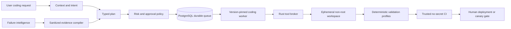

# Coding-agent execution architecture

## Scope and non-negotiable boundary

The coding agent has two consumers: authenticated end users asking for repository work,
and the governed improvement system producing a candidate for a diagnosed failure. Both
use one deterministic Rust tool broker. Neither an LLM nor a browser receives a shell,
production OAuth credentials, database owner credentials, deployment credentials, or a
way to assert that validation passed.

The isolated coding/candidate process reads `CODING_GROQ_API_KEY`; ordinary application
services use a distinct Gemini `RUNTIME_API_KEY` and must not inherit the coding
credential. The Rust subprocess receives neither provider key. Legacy persisted route
labels may still be interpreted while old runs finish, but they never select a Groq
runtime client.

Repository ingress has two first-class modes. Hosted repositories use a least-privilege
GitHub App and short-lived installation tokens. Private folders that are not hosted—or
are not Git repositories at all—use `gca-local` on the owner's machine. Both modes feed
the same typed Rust broker and evidence format; local mode is not a bypass around policy.

“AI for tool calling, not code generation” means the model may select a typed operation
and bounded arguments. Arbitrary source bodies, shell programs, SQL mutations and CI
attestations are not model outputs. Novel edits therefore require a trusted deterministic
transformation recipe or a separately approved code-generation policy; pretending that
an unrestricted coding agent can author arbitrary software without producing code would
be contradictory.

## Durable flow



The durable run records every tool name, policy version, input hash, duration, bounded
result facts, exit status and artifact hash. Raw secrets and unrestricted source dumps do
not enter telemetry or model history. A worker restart resumes from the last verified
checkpoint and never repeats a write without reconciliation.

## Rust broker v0.2

The repository broker provides:

- bounded repository inventory, literal search, line reads and SHA-256 hashing;
- structured Git status and diff inspection;
- fixed validation profiles for Python, web, Flutter, Rust and `git diff --check`;
- canonical root enforcement, parent-traversal rejection and symlink containment;
- credential-path and generated-directory exclusion;
- a one-megabyte JSON request ceiling, bounded file/search/output sizes and timeouts;
- direct process execution with an allowlist, cleared environment and no shell.
- exact single-occurrence text replacement guarded by the complete source-file SHA-256,
  available only to a mutable broker created inside an ephemeral workspace.
- expected-absent new-file creation with the same preview, validation, approval, atomic
  application, and rollback boundary;
- aggregate project manifests/language/test counts and declaration-aware symbol lookup so
  the planner does not spend model turns rediscovering basic repository structure.

It intentionally does not provide arbitrary writes, package installation, raw SQL,
network access, deployment or process termination. Separate compiled read-only brokers now
provide process names without arguments, workspace log tails, migration inventories,
PostgreSQL server/schema/extension metadata in a forced read-only transaction, and
Compose/image inspection without build/push/restart/deploy. This separation is a security
property, not a missing hidden terminal. The normal JSON broker executable remains
read-only; only its trusted local orchestrator can construct the ephemeral mutable variant.

## Local private/non-Git runner

Install the CLI from a trusted checkout:

```bash
cargo install --locked --path coding_runtime --bin gca-local
gca-local doctor --workspace /absolute/path/to/private-project
```

The repository helper `scripts/install_local_coding_runner.sh` installs and probes the
binary even when Cargo's bin directory is not yet on `PATH`; it prints the exact directory
to add for future terminal sessions.

The execution input is a typed JSON plan, not shell text. A mutation plan must end with
a fixed validation profile after its final patch:

```json
{
  "actions": [
    {"tool": "read_lines", "path": "app/main.py", "start_line": 1, "end_line": 80},
    {
      "tool": "apply_exact_patch",
      "path": "app/main.py",
      "expected_sha256": "<64 hexadecimal characters>",
      "old": "exact old text",
      "replacement": "exact new text"
    },
    {"tool": "run_validation", "profile": "python_unit", "timeout_seconds": 300}
  ]
}
```

Run it once without approval:

```bash
gca-local execute-plan --workspace /path/to/project --plan plan.json
```

The runner copies allowed regular files into a temporary directory, excluding credentials,
`.git`, dependencies and generated output. It executes and validates there, prints changed
hashes and an approval token, and proves `original_workspace_modified: false`. To apply,
rerun the exact plan with `--approve <plan-sha256>`. The runner reconstructs a fresh
sandbox, repeats validation, rechecks every original preimage hash and atomically replaces
only approved files. If a later replacement fails, it restores already-replaced files from
their retained preimages and reports any rollback failure for manual reconciliation. This
works identically when `.git` does not exist.

The current CLI is the deterministic local execution boundary. The natural-language
planner is a separately bounded Rust component: it may request these typed actions but
cannot call a shell, read excluded files, mint approval tokens or claim validation passed.

For a Groq-planned request, put the instruction in a local file rather than shell history:

```bash
printf 'Change the validated parser without changing its public schema.\n' > /tmp/task.txt
gca-local plan-request \
  --workspace /path/to/private-project \
  --request-file /tmp/task.txt \
  --allow-cloud-source true
```

`--allow-cloud-source true` is mandatory because the request and bounded source excerpts
leave the machine for the Groq API. Omit it when source must remain fully offline and use
`execute-plan` with a locally prepared typed plan instead. Natural-language mode reads only
`CODING_GROQ_API_KEY`, uses the fixed Groq HTTPS endpoint, permits at most ten sequential
tool turns, disables parallel tool calls, caps each result inserted into model history, and
requires a tool call on every turn. It cannot select another provider or arbitrary endpoint.

Each request writes a mode-`0600` audit journal and frozen plan beneath
`~/.local/state/gca-local` (or an explicitly selected `--state-dir`). The journal records
the model, consent, private model/tool messages, hashes, token counts, status and plan
identity without the API key. If Groq or the process is interrupted after a completed tool
turn, resume that exact bounded checkpoint (renewing source-egress consent) with:

```bash
gca-local resume-request \
  --workspace /path/to/private-project \
  --run-id local-0123456789abcdef0123 \
  --allow-cloud-source true
```

Read-only investigation runs in an environment-cleared child process. Sandbox preview also
runs in a separate environment-cleared child, so the Groq key is absent before validation
and mutation authority exists. A successful preview renders a bounded unified diff and
writes a mode-`0600` `<plan>.approval.json` manifest containing exact before/after hashes,
the approval token and validation evidence. The approved invocation reruns the complete
plan in a fresh sandbox, checks every preimage, applies all files transactionally with
rollback, and changes the manifest status to `applied`.

## Hosted GitHub App boundary

`GITHUB_CODING_APP_ID`, `GITHUB_CODING_APP_INSTALLATION_ID`, and
`GITHUB_CODING_APP_PRIVATE_KEY` configure hosted repository access. The server signs a
GitHub App JWT, asks GitHub for a short-lived token restricted to the configured repository,
and uses that token for candidate Actions, draft PRs and governed promotion. Partial App
configuration fails closed. `GITHUB_PROPOSAL_TOKEN` is retained only for migration and
should be removed after the App path is verified.

Hosted runs are available through the administrator-pilot `/coding` page and `/coding/runs`
API. A run records its encrypted request, source-egress consent, immutable base commit,
planner/tool/OKF versions, ordered steps/events/artifacts, leases, heartbeats, tokens,
approval hash/expiry, branch/PR, trusted-CI URL, errors, retention, and deletion state.
The worker creates only a draft PR; it does not merge or deploy. Failure-intelligence
candidate records link to one coding run so the legacy candidate worker cannot also claim
or retry the same work.

## Deterministic tool families

| Family | Safe operations | Additional gate for mutation |
|---|---|---|
| Repository | inventory, symbols, bounded reads, hashes, language/dependency inventories | transformation recipe, expected hash, reversible patch |
| Validation | compile, lint, unit/integration tests, diff inspection | none; read-only execution profile |
| Processes | process name/parent/age/state, bounded workspace log tail, migration inventory | no command arguments, signals, or arbitrary paths |
| Database | server/schema/table/extension metadata in read-only transactions | credentials injected by trusted caller; no SQL supplied by model |
| DevOps | Compose validation/status and local image metadata | no build, push, login, restart, scale, delete, or deploy operation |
| Conversion | hash-bound source/target contract and feature-risk inventory | exact patch/create recipe plus compiler and differential tests |
| Algorithms | bounded lexical complexity localization with explicit non-proof flags | exact control-flow inspection and benchmark/evaluation evidence before replacement |

## Candidate-builder integration

The improvement system must admit only a concrete, automation-eligible strategy with
specific occurrence or cross-cluster evidence. A deterministic evidence compiler derives
service, operation and write risk from the registered runtime tools, localizes real source
and nearby tests, and produces the initial broker calls. Finalization is impossible before
real implementation and test files were read, a non-empty integrated patch exists, syntax
passes and the trusted CI identity supplies validation evidence.

Old terminal/fileless builds remain immutable and are labelled superseded. They are never
resumed as if a safe checkpoint existed.

Candidate policy v19 uses the shared durable coding runtime and Rust broker for repository
inventory, language/dependency/complexity evidence, literal/symbol search, bounded source
reads, hash-bound transformations, and validation planning whenever the packaged binary
exists. Existing Python candidate records keep their immutable historical evidence and
the in-memory compatibility reader remains for source-only unit environments; it is not a
hidden fallback after a Rust broker denial. A broker denial is terminal for that tool call.

The dependency and complexity tools deliberately label their output as bounded lexical
evidence. They do not claim a complete call graph, cyclomatic score, Big-O proof, or
semantic equivalence. The conversion tool creates a source-hash-bound evidence contract;
actual conversion still requires an exact sandbox transformation, target compiler/parser,
shared behavioral fixtures, and differential tests.

## Token discipline and planning principles

The system applies a compact evidence-first sequence:

1. Verify that a change is needed.
2. Reuse an existing runtime path, registry or recipe.
3. Localize symbols and tests deterministically.
4. Read only the bounded neighborhood required for the invariant.
5. Select the smallest reversible transformation.
6. Validate locally, inspect the diff, then use trusted CI.

Review roles do not run before a compilable candidate exists. A model never repeatedly
searches once deterministic localization has produced valid paths. This follows the
project's Karpathy-style rules (think, simplify, make surgical changes, verify) and the
Ponytail ladder (question existence, reuse, standard/platform/library mechanisms, then
minimum custom code), without deleting required security or correctness controls.

Natural-language planning preloads a deterministic project summary, caps each model-visible
tool result at 8,000 characters, permits at most ten sequential turns and refuses the next
provider call when its cumulative preflight would exceed 10,000 tokens. The ceiling may
block an underspecified oversized request; it never weakens source, validation, approval,
or release gates to force a result.

## Dynamic cache policy

Cache behavior is selected by data semantics, not a global TTL:

- immutable commit/file hashes: content-addressed and long lived;
- repository inventory: invalidated by worktree/commit identity;
- source excerpts: keyed by path plus file hash;
- process health/log tails: seconds and never reused as proof of current health;
- database schema: keyed by migration revision;
- validation evidence: immutable for the exact tree, toolchain and command profile;
- OAuth, secrets and raw private content: never cached in the broker or model history.

Every cache entry records producer version, source version, ACL/tenant, creation time,
expiry/invalidation rule and content hash. A cache hit cannot satisfy a live-write
postcondition or production-health claim.

This is implemented by encrypted tenant-scoped `coding_cache_entries`. Unknown entities
fail closed. Immutable source/validation evidence is content-addressed; repository,
excerpt, schema, process/log, deployment, and OKF observations use different TTL and
invalidation rules. Secrets, raw private content, write results, and approvals are rejected.

## OKF in the coding runtime

Each coding run pins the latest trusted bundle and selects public coding/candidate workflow
documents through structured tags. The IDs, bundle hash, and selection reason are durable
evidence and the bounded content is supplied to planning as operational guidance. The
compiled broker schemas, path policy, credential separation, approval hash, fixed
validation, GitHub/CI identity, and release gates remain authoritative if OKF is absent,
stale, malformed, or adversarial.

## Scaling decisions

The existing PostgreSQL lease queue is sufficient until measurements demonstrate a need
for another orchestrator. Kafka or Temporal must not be introduced merely for prestige:
they become candidates only when measured throughput, event fan-out, very long workflow
history or cross-service scheduling exceeds the current durable worker design. The same
rule applies to additional vector databases and caching products.
