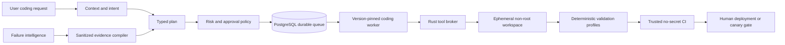

# Coding-agent execution architecture

## Scope and non-negotiable boundary

The coding agent has two consumers: authenticated end users asking for repository work,
and the governed improvement system producing a candidate for a diagnosed failure. Both
use one deterministic Rust tool broker. Neither an LLM nor a browser receives a shell,
production OAuth credentials, database owner credentials, deployment credentials, or a
way to assert that validation passed.

“AI for tool calling, not code generation” means the model may select a typed operation
and bounded arguments. Arbitrary source bodies, shell programs, SQL mutations and CI
attestations are not model outputs. Novel edits therefore require a trusted deterministic
transformation recipe or a separately approved code-generation policy; pretending that
an unrestricted coding agent can author arbitrary software without producing code would
be contradictory.

## Durable flow

The durable run records every tool name, policy version, input hash, duration, bounded
result facts, exit status and artifact hash. Raw secrets and unrestricted source dumps do
not enter telemetry or model history. A worker restart resumes from the last verified
checkpoint and never repeats a write without reconciliation.

## Rust broker v0.1

The first broker release provides:

- bounded repository inventory, literal search, line reads and SHA-256 hashing;
- structured Git status and diff inspection;
- fixed validation profiles for Python, web, Flutter, Rust and `git diff --check`;
- canonical root enforcement, parent-traversal rejection and symlink containment;
- credential-path and generated-directory exclusion;
- a one-megabyte JSON request ceiling, bounded file/search/output sizes and timeouts;
- direct process execution with an allowlist, cleared environment and no shell.

It intentionally does not yet provide arbitrary writes, package installation, raw SQL,
network access, deployment or process termination. Those require separate typed brokers,
approval classes, idempotency contracts and tests. This is a security property, not a
missing hidden terminal.

## Planned deterministic tool families

| Family | Safe operations | Additional gate for mutation |
|---|---|---|
| Repository | inventory, symbols, references, bounded reads, hashes | transformation recipe, expected hash, reversible patch |
| Validation | compile, lint, unit/integration tests, diff inspection | none; read-only execution profile |
| Processes | list owned processes, health, bounded logs | approved service identity; no arbitrary PID kill |
| Database | schema/plan/read-only query, sanitized dump metadata | dedicated role, migration allowlist, backup and approval |
| DevOps | manifest render, image/SBOM scan, deployment status | signed artifact and human production gate |
| Conversion | AST/IR parse and language feature inventory | verified converter recipe plus differential tests |
| Algorithms | complexity inventory, invariant and data-flow checks | benchmark/evaluation evidence before replacement |

## Candidate-builder integration

The improvement system must admit only a concrete, automation-eligible strategy with
specific occurrence or cross-cluster evidence. A deterministic evidence compiler derives
service, operation and write risk from the registered runtime tools, localizes real source
and nearby tests, and produces the initial broker calls. Finalization is impossible before
real implementation and test files were read, a non-empty integrated patch exists, syntax
passes and the trusted CI identity supplies validation evidence.

Old terminal/fileless builds remain immutable and are labelled superseded. They are never
resumed as if a safe checkpoint existed.

## Token discipline and planning principles

The system applies a compact evidence-first sequence:

1. Verify that a change is needed.
2. Reuse an existing runtime path, registry or recipe.
3. Localize symbols and tests deterministically.
4. Read only the bounded neighborhood required for the invariant.
5. Select the smallest reversible transformation.
6. Validate locally, inspect the diff, then use trusted CI.

Review roles do not run before a compilable candidate exists. A model never repeatedly
searches once deterministic localization has produced valid paths. This follows the
project's Karpathy-style rules (think, simplify, make surgical changes, verify) and the
Ponytail ladder (question existence, reuse, standard/platform/library mechanisms, then
minimum custom code), without deleting required security or correctness controls.

## Dynamic cache policy

Cache behavior is selected by data semantics, not a global TTL:

- immutable commit/file hashes: content-addressed and long lived;
- repository inventory: invalidated by worktree/commit identity;
- source excerpts: keyed by path plus file hash;
- process health/log tails: seconds and never reused as proof of current health;
- database schema: keyed by migration revision;
- validation evidence: immutable for the exact tree, toolchain and command profile;
- OAuth, secrets and raw private content: never cached in the broker or model history.

Every cache entry records producer version, source version, ACL/tenant, creation time,
expiry/invalidation rule and content hash. A cache hit cannot satisfy a live-write
postcondition or production-health claim.

## Scaling decisions

The existing PostgreSQL lease queue is sufficient until measurements demonstrate a need
for another orchestrator. Kafka or Temporal must not be introduced merely for prestige:
they become candidates only when measured throughput, event fan-out, very long workflow
history or cross-service scheduling exceeds the current durable worker design. The same
rule applies to additional vector databases and caching products.
