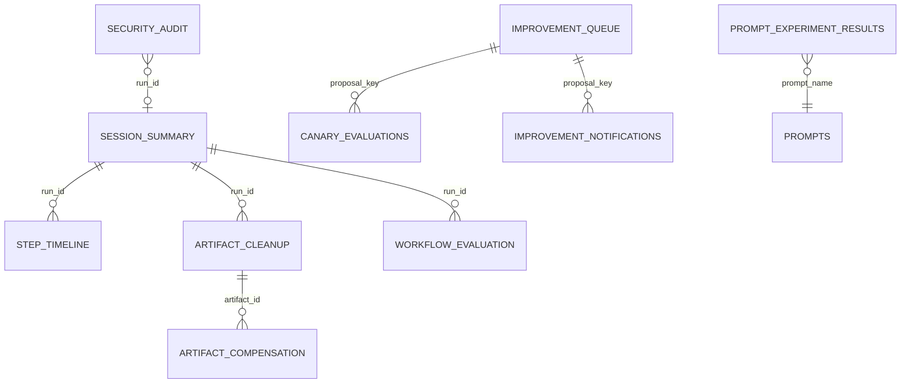

# DBeaver connections

Use three visually distinct connections under the `Google Connector` folder.

## Production

- Name: `Google Connector — PRODUCTION NEON READ ONLY`
- Folder: `Google Connector/Production`
- Color: red
- SSL: required
- Role: `dbeaver_analyst`
- Transaction mode: read only
- Schemas: prefer `reporting`; the role cannot read OAuth credentials.

Create/rotate the role with `scripts/configure_reporting_role.sql` using the Neon owner connection. Store the generated password only in DBeaver secure storage/macOS Keychain.

Verified on 2026-07-20: all three connection definitions are installed without saved
passwords. The production `dbeaver_analyst` secret is stored in macOS Keychain under
service `google-connector-neon-reporting`. Connecting with that credential reports
`transaction_read_only=on`, permits `reporting.session_summary`, and denies
`google_oauth_credentials`. If DBeaver should remember the password itself, copy it
locally from Keychain into DBeaver's password field and select Save password; that
optional GUI action stores a second copy in DBeaver's encrypted credential vault.

## Local Homebrew

- Name: `Google Connector — LOCAL HOMEBREW`
- Folder: `Google Connector/Local`
- Color: green
- Host: `::1` (or the authoritative Homebrew socket/host)
- Port: `5432`
- Database/user: `agent_db` / `agent_user`

## Local Docker

- Name: `Google Connector — LOCAL DOCKER`
- Folder: `Google Connector/Local`
- Color: blue
- Host: `127.0.0.1` (explicit IPv4 avoids the local Homebrew listener)
- Port: `55432` (dedicated loopback binding; container port remains 5432)
- Database/user: `agent_db` / `agent_user`

Never commit DBeaver credentials or a Neon owner URL. Use the reporting views for run status, timelines, failures, tokens, retrieval, artifacts, compensation, evaluations, notifications, improvements, and canaries.

## Reporting relationship map

Refresh the `reporting` schema after migration 011. The dedicated role can select
`session_summary`, `step_timeline`, `failure_summary_daily`, `model_token_usage`,
`tool_reliability`, `retrieval_quality`, `artifact_cleanup`, `improvement_queue`,
`canary_evaluations`, `prompt_experiment_results`, `security_audit`,
`workflow_evaluation`, `artifact_compensation`, `improvement_notifications`,
`failure_intelligence`, `failure_cluster_summary`, `failure_notifications`, and
`rag_parent_lineage`. The last view exposes versions, hashes, and active child counts
without parent text. The analyst still cannot read encrypted OAuth credential rows.

Reverified on 2026-07-21 against the installed DBeaver definitions and actual database
endpoints: Production Neon, local Homebrew, and local Docker each expose 18 reporting
views at revision 011. Neon reports `current_user=dbeaver_analyst` and
`transaction_read_only=on`; all failure and RAG-lineage views are selectable; a direct
`google_oauth_credentials` query is denied. The Docker definition uses port 55432
because another local PostgreSQL cluster owns 5433; this avoids silently inspecting
the wrong database.
