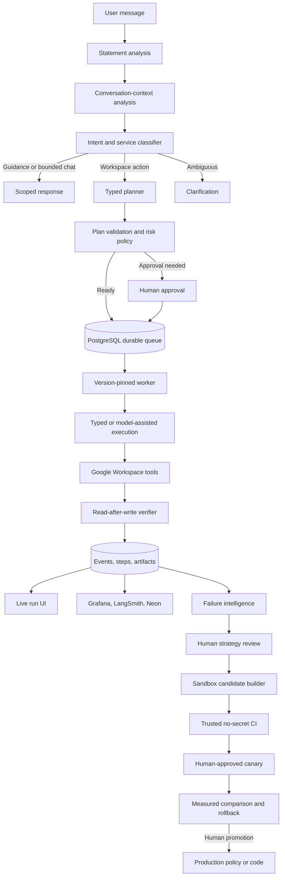
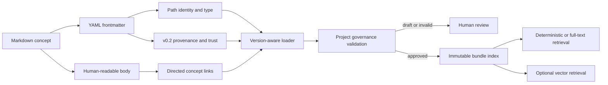
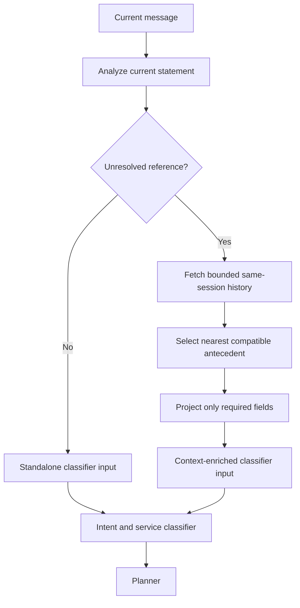
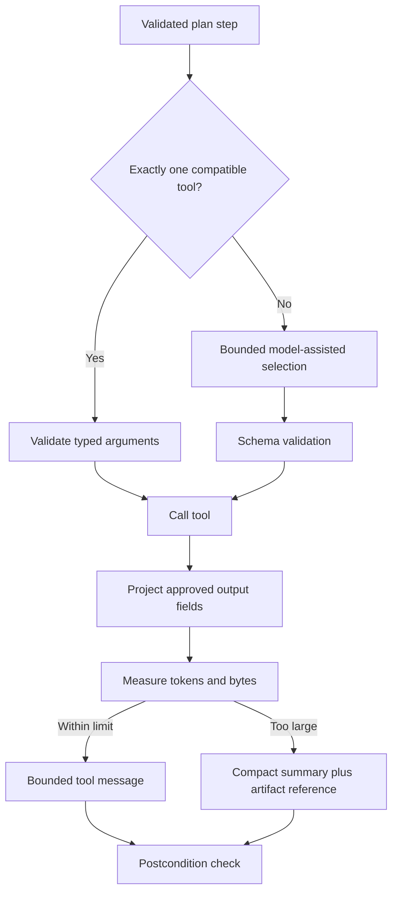
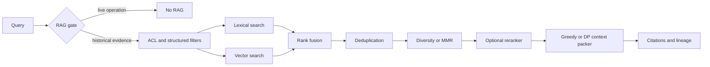
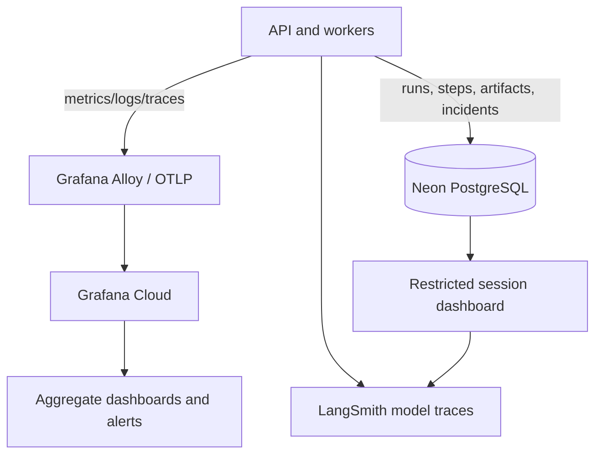
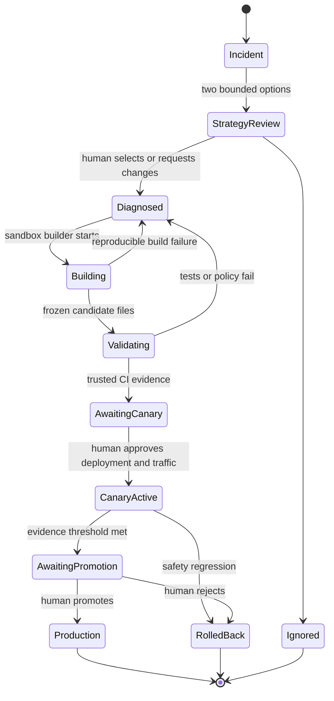
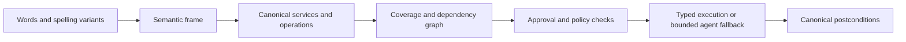
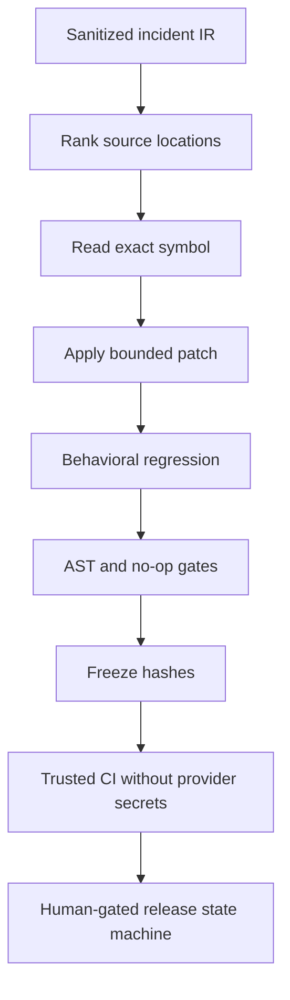

# Learning agentic systems through this repository

This guide connects the project's implementation to the data structures and
algorithms that make durable agents reliable. It is intentionally grounded in
the code in this repository rather than isolated textbook exercises.

Use each lesson in the same order: understand the invariant, locate its
implementation, trace one request, calculate complexity, then change a fixture
and predict the result before running it. This turns DSA into an engineering
tool rather than a collection of interview tricks.

## How to use this guide

This is both a course and a reference manual. Read it in five passes:

1. **System map:** understand how one request crosses context analysis, planning,
   execution, verification, monitoring, and governed improvement.
2. **Core structures:** study graphs, state machines, queues, hashes, trees,
   retrieval indexes, and optimization.
3. **Production flows:** trace the same concepts through the exact repository
   modules and database records.
4. **Python laboratory:** run the small implementations and deliberately break
   their invariants.
5. **Deep dictionary:** use the final alphabetical section when a term is
   unfamiliar. Each entry gives the definition, project role, Python shape,
   complexity or invariant, and the common mistake.

The guide distinguishes three levels of truth:

- **Implemented now** means the named repository path contains the behavior.
- **Designed or feature-flagged** means the architecture supports an experiment,
  but it is not automatically the production winner.
- **Future evidence required** means production samples, human labels, or
  approval are still needed before promotion.

### The whole system in one picture



The essential boundary is that the execution loop acts on user-authorized
Workspace resources, while the improvement loop acts on sanitized evidence and
isolated candidates. Failure evidence never grants production authority.

### Coverage and audit map

| Area | What this guide covers | Principal implementation |
|---|---|---|
| Request meaning | statement analysis, selective history, intent dispatch | `app/runs/request_analysis.py`, `app/runs/context.py`, `app/runs/informational.py` |
| Planning | typed steps, dependencies, validation, approvals | `app/runs/planner.py`, `app/runs/schemas.py`, `app/runs/approval_preview.py` |
| Durable execution | queue claims, leases, heartbeats, retries, version pinning | `app/runs/worker.py`, `app/runs/worker_entry.py`, `app/runs/repository.py` |
| Correctness | preconditions, postconditions, artifacts, reconciliation | `app/runs/verifier.py`, `app/runs/reconciliation.py` |
| Retrieval | source-aware chunks, hybrid search, DP/greedy packing | `app/rag/chunking.py`, `app/rag/retriever.py`, `app/rag/context_packer.py` |
| Operational knowledge | governed Markdown bundle and retrieval | `app/okf/loader.py`, `app/okf/retriever.py`, `app/okf/candidates.py`, `knowledge/` |
| Learning | fingerprints, proposals, candidates, replay, canary | `app/improvements/`, `app/evaluation/`, `app/mlops/` |
| Privacy and lifecycle | tenant isolation, retention, export, deletion | `app/runs/retention.py` and database constraints |

Earlier versions of this guide explained the major algorithms but did not fully
cover Python foundations, selective conversational context, typed fallback,
database concurrency, observability cardinality, the end-to-end candidate
lifecycle, or an indexed terminology reference. Sections 21 onward close those
gaps.

## 1. Graphs, DAGs, and topological execution

An execution plan is a directed graph. A step is a vertex and a dependency is a
directed edge. The planner creates the graph; the worker executes only vertices
whose incoming dependencies are complete. Independent read vertices may run in
parallel, while mutation chains remain ordered.

Example: `fetch Gmail -> create Sheet -> verify link -> {send Chat, create Meet}`.
Chat and Meet are parallel only after the verified Sheet URL exists. A cycle
means the plan is invalid. Topological ordering, cycle detection, bounded
concurrency, and dependency-failure propagation live conceptually in
`app/runs/planner.py` and `app/runs/worker.py`.

## 2. State machines and durable runs

`agent_runs`, `agent_run_steps`, and append-only `agent_run_events` form a state
machine. Valid transitions prevent a run from jumping from queued directly to
success, preserve evidence after a crash, and allow a restarted worker to resume
from the first safe incomplete step. Leases and heartbeats distinguish a slow
run from an abandoned worker.

This is the same idea as a distributed transaction log: current state is useful,
but the event history explains how that state was reached.

## 3. Queues, heaps, and scheduling

The PostgreSQL queue uses row locks and `FOR UPDATE SKIP LOCKED` so multiple
workers claim different jobs safely. A future priority scheduler could use a
heap ordered by risk, age, deadline, and estimated cost. Retry scheduling is a
delayed queue problem, while per-user and global limits are fairness constraints.

## 4. Hash maps, sets, and idempotency

A deterministic idempotency key maps one logical external write to one durable
result. Before retrying Gmail, Calendar, Sheets, Docs, or Chat, the executor checks
for a recorded or reconcilable artifact. Hash maps provide constant-time lookup;
sets deduplicate senders, document hashes, tool names, and OAuth scopes.

Content hashes also make RAG indexing incremental: unchanged chunks do not need
new embeddings.

## 5. Trees, chunking, and retrieval indexes

Google Docs have a heading tree. A small child chunk supports precise matching;
its parent section restores broader context. Gmail uses thread/message lineage,
Sheets use header-aware row groups, PDFs use layout/table/OCR boundaries, and
Meet transcripts use speaker turns and topics. There is no universally correct
chunk size because each source has a different structure and query distribution.

pgvector's HNSW index is itself a proximity graph. Hybrid retrieval combines
vector neighbors with PostgreSQL full-text results, then fuses ranks, removes
duplicates, preserves permissions, and packs context under a token budget.

The durable hierarchy is split across `rag_chunks` and `rag_parent_sections`.
Only small children receive embeddings and participate in precise matching. A selected
child's `(tenant, source, source ID, parent ID, chunker version)` expands to one larger
generation parent. The citation keeps the matched child ID, while a reporting view
exposes lineage counts and hashes without exposing parent text.

## 6. Sliding windows, greedy packing, and dynamic programming

Token-aware overlapping windows are useful only when a source has no better
semantic boundary. Context packing is currently a constrained selection problem:
maximize relevant, diverse evidence without exceeding a token budget. A greedy
score-per-token method is fast; dynamic programming can find a better knapsack
solution when exact optimization is worth its cost.

Model and workflow selection is another constrained optimization problem across
correctness, latency, token quota, risk, and tool count.

## 7. Backtracking, replanning, and compensation

When a postcondition fails, the recovery path resembles bounded backtracking:
retain the verified prefix, reject the bad branch, and choose a safe alternative.
External writes cannot simply be undone in memory, so compensation is explicit:
report and preserve a useful artifact, retry population, roll back sharing, or
delete/cancel only with the required approval.

## 8. Memoization, caches, and rate limiting

Embedding hashes, verified artifact records, and tool results are memoized work.
They reduce latency and protect quotas. Token-bucket or leaky-bucket algorithms
fit per-user Google/API and model limits. Bounded concurrency prevents one run
from exhausting the entire service.

Consistent hashing becomes useful if sessions or tenants later need stable
placement across multiple worker/cache partitions.

## 9. Bandits, MDPs, and later reinforcement learning

A contextual bandit may choose only among already validated, low-risk policies:
RAG/no-RAG, prompt variants, safe-read models, or retrieval strategies. Reward
components stay separate: completion, correctness, latency, tokens, user rating,
tool errors, orphaned artifacts, and unsafe effects.

The stored trajectory schema—state, decision, action, observation, reward, next
state—makes offline policy evaluation possible. Live exploratory RL is locked.
It must never experiment with real email, Chat, invitations, sharing, or deletion.
Most current reliability gains come from orchestration, verification, and
idempotency rather than model fine-tuning.

## 10. OKF in this project

The `knowledge/` bundle is curated operational knowledge expressed as Markdown
with validated YAML frontmatter. It contains capabilities, workflows, policies,
schemas, metrics, failure guidance, RAG source rules, and runbooks.

OKF has four important boundaries:

- Live Google APIs answer current facts and perform actions.
- PostgreSQL stores durable runs, artifacts, telemetry, and structured facts.
- User-content RAG retrieves tenant-scoped evidence from email and documents.
- OKF supplies trusted operational rules and explanations.

Retrieved email or document content is untrusted evidence; it can never override
OKF policy or system authority. Deterministic generation may create an OKF draft,
but only human-approved documents become trusted. Each document records ownership,
version, publication state, provenance, and links. Runtime retrieval records the
OKF version so a failed run can be replayed against a candidate version.

The safe improvement loop is therefore:

`incident -> sanitized evidence -> draft -> validation -> offline replay -> human
canary approval -> bounded canary -> automatic rollback or human promotion`.

That loop improves the system while keeping the public repository, private user
content, and production authority cleanly separated.

## 11. Dynamic programming: context as a knapsack

Suppose retrieval returns `n` candidate chunks. Chunk `i` has token cost `w[i]`,
estimated value `v[i]`, source and parent metadata, and a hard total budget `B`.
The simplest exact formulation is zero/one knapsack:

```text
dp[i][b] = best value using the first i chunks with at most b tokens

dp[i][b] = dp[i-1][b]                              if w[i] > b
dp[i][b] = max(dp[i-1][b], dp[i-1][b-w[i]]+v[i]) otherwise
```

Time is `O(nB)` and the full table uses `O(nB)` memory. If only the score is
needed, iterate `b` backwards and use `O(B)` memory. Retain parent pointers to
reconstruct which chunks were selected.

The production packer in `app/rag/context_packer.py` is greedy because token
budgets are large, relevance is uncertain, and diversity, parent expansion,
recency, and duplicate penalties make value context-dependent. The robust design
is to enforce ACL/safety first, deduplicate, use fast greedy packing online, and
compare it offline with an exact or beam-search oracle on labelled examples.

Exercise: use costs `[120, 200, 280, 350, 500, 700]`, values
`[0.30, 0.48, 0.60, 0.72, 0.82, 0.90]`, and budget `900`. Compare value sorting,
value-per-token sorting, and exact DP. Then allow at most two Gmail chunks. The
state becomes `dp[i][b][gmail_count]`, demonstrating how constraints expand DP.

## 12. Graphs: planning and topological execution

In `app/runs/planner.py`, every `PlanStep` is a vertex and every dependency is a
directed edge. `validate_plan` checks predecessor existence and ordering. In
`app/runs/worker.py`, `_claim_step` selects only a pending step whose dependencies
are complete.

Kahn's topological-sort model is:

```text
indegree[v] = unfinished prerequisites of v
ready = vertices whose indegree is zero

while ready:
    v = ready.pop()
    execute v
    for each edge v -> u:
        indegree[u] -= 1
        if indegree[u] == 0: ready.push(u)
```

This is `O(V+E)`. If fewer than `V` vertices are removed, the remainder contains
a cycle. The worker stores graph state in PostgreSQL so a process restart does
not erase progress. Several ready reads may execute concurrently; dependent or
unsafe mutations remain ordered.

Exercise: draw the graph for “find the last twenty Gmail senders, create a Sheet,
then send its verified link in Chat and create a Calendar event with a Meet link.”
Mark reads, writes, verification, and the first point where two branches can run
concurrently.

## 13. Queues, leases, and distributed state machines

`claim_run` and `_claim_step` use `FOR UPDATE SKIP LOCKED`. A database row is a
durable queue node and the row lock is an atomic claim. Two workers can scan the
same queue but cannot claim the same item.

```text
claim: owner = worker_id, lease_expires_at = now + lease_duration
heartbeat: extend only if owner still matches
recovery: expired running rows become claimable again
```

A retry must preserve the idempotency key, completed-step ledger, and external
artifacts. Otherwise recovery could send the same email twice. Queue performance
depends on partial indexes over runnable states; fairness additionally requires
per-user limits and an age/risk/deadline policy.

The lease-recovery policy deliberately distinguishes computation from side effects:

- an interrupted read is returned to `pending` only while its bounded retry budget
  remains;
- an exhausted read becomes a normal recoverable worker failure;
- an interrupted write is never retried blindly, because the Google API may have
  committed immediately before the worker died;
- that ambiguous write becomes `worker_reconciliation`, records a portal incident,
  sets side-effect integrity to unknown/unsafe, and blocks ordinary resume until the
  external resource has been reconciled.

This is a practical distributed-systems invariant: absence of a local acknowledgement
does not prove absence of a remote side effect.

## 14. Hash maps, sets, and effectively-once effects

`app/runs/repository.py` stores request idempotency keys. The planner binds an
approval to an action hash. Google mutation tools derive deterministic request
IDs and record returned artifact IDs.

Exactly-once computation is generally unavailable across arbitrary networks.
Effectively-once external effects are achieved through idempotency,
reconciliation, read-after-write verification, and durable evidence. Hash maps
provide expected `O(1)` lookup from logical action to artifact; sets deduplicate
senders, tool names, OAuth scopes, and content hashes.

Collision resistance is not authorization. Every lookup still includes the
tenant boundary, and a recovered artifact must match the intended recipient,
file, event, or Chat space.

## 15. Search structures: full text, vectors, and HNSW

`app/rag/retriever.py` combines PostgreSQL lexical ranking and pgvector neighbors
with reciprocal-rank fusion. An item at rank `r` contributes approximately
`1/(k+r)`, avoiding the false assumption that lexical and vector scores share a
numeric scale.

HNSW is a layered proximity graph. Sparse upper layers navigate quickly toward a
query neighborhood; the dense bottom layer refines candidates. It trades exact
nearest-neighbor guarantees for practical latency, with graph degree and search
breadth trading memory/build time for recall.

The complete retrieval sequence is:

```text
classify -> tenant/source/date filters -> lexical + vector retrieval
-> rank fusion -> deduplicate -> diversify -> optional rerank -> pack -> cite
```

Chunking is source-specific in `app/rag/chunking.py`: Gmail thread lineage, Docs
headings, Sheet row groups, Chat threads, PDF layout/table/OCR boundaries, Meet
speakers/topics, and structured records that need no ordinary splitting.
Chunk-size winners remain empirical; versioned chunks allow controlled replay.

## 16. Bandits, MDPs, and why this is not live RL

A contextual bandit observes context, selects one already validated action, and
receives a reward without modelling a long transition sequence. It fits bounded
choices such as prompt A/B, RAG gate, safe-read model, or retrieval policy.

An MDP adds transitions:

```text
(state, action) -> observation/reward -> next_state
```

The governed trajectory dataset stores that shape, but real Google writes are
not an exploration environment. Offline replay uses mock adapters, stable
holdouts, and separately reported completion, correctness, safety, latency, and
token outcomes. Most observed failures—timeouts, quota, missing dependencies,
bad retries, absent verification—are systems problems that fine-tuning cannot fix.

## 17. OKF v0.2, compatibility, and this project's v0.1 profile

Google's current public OKF specification is **v0.2**. It is a vendor-neutral
format, not a hosted service, model, agent, or Python library. A bundle is a
directory of UTF-8 Markdown files with YAML frontmatter. A concept's identity is
its bundle-relative path without `.md`. Only `type` is always required.
`index.md` and `log.md` are reserved navigation and history files, not concepts.
Markdown links form directed untyped graph edges, and consumers must tolerate
broken links.

Version 0.2 is additive and backward-compatible with v0.1. It introduces
optional first-class trust, provenance, and lifecycle vocabulary:

- `sources` records upstream evidence.
- `generated` records when and by which actor a document was produced.
- `verified` records machine or human verification and supports the derived
  trust tiers unverified, machine-confirmed, and human-reviewed.
- `status` distinguishes draft, stable, and deprecated knowledge.
- `stale_after` expresses when consumers should reconsider freshness.
- attested computation separates an executor and its receipt from a
  deterministic, no-LLM attester.

In v0.2, `generated.at` supersedes the v0.1 `timestamp` convention and `sources`
supersedes an informal body citation list. A compatible consumer may fall back
to the v0.1 fields.

Official sources:

- [Google Cloud OKF v0.2 announcement](https://cloud.google.com/blog/products/data-analytics/okf-v0-2-adds-trust-signals/)
- [Official OKF specification](https://github.com/GoogleCloudPlatform/knowledge-catalog/blob/main/okf/SPEC.md)
- [Reference implementation and samples](https://github.com/GoogleCloudPlatform/knowledge-catalog/tree/main/okf)

**Repository status:** the code currently stores `okf_version="v0.1"` and the
bundle declares `okf_version: "0.1"`. It therefore implements a stricter,
governed **v0.1-compatible project profile**; this guide does not claim that
v0.2 runtime ingestion is already implemented.

This repository layers a stricter operational profile on the minimal format.
Concepts additionally carry owner, version, visibility, publication status, and
approval evidence. The generic loader consumes a minimal v0.1 concept, but
production synchronization refuses to trust it until the governance fields and
human approval are valid. Those are project rules, not OKF requirements.

Adopting v0.2 requires a deliberate migration: extend the loader schema; preserve
v0.1 fallbacks; validate `sources`, `generated`, `verified`, `status`, and
`stale_after`; add compatibility fixtures; version the bundle; re-index; replay
retrieval; and promote only after human review. OKF's human-reviewed trust tier
is useful evidence, but it does not replace this project's stronger approval
gates for external writes, canaries, or policy publication.



OKF does not replace RAG, Neon/pgvector, live Google APIs, MCP/tool protocols, or
prompts. It represents portable curated knowledge. RAG may retrieve it; databases
may index it; APIs provide current facts and actions; protocols expose tools.

## 18. Hands-on sequence

1. Run the planner golden set and draw one execution DAG.
2. Add a cyclic plan fixture and predict the validation error.
3. Compare greedy context packing with a small exact knapsack implementation.
4. Change one Gmail chunk and verify only its content hash/version needs reindexing.
5. Simulate a crash after verified Sheet creation and prove resume does not
   recreate the Sheet.
6. Add a minimal OKF concept containing only `type`; confirm it is consumable but
   not trusted as production policy.
7. Add approval metadata, synchronize, and inspect its section chunks.
8. Compare two retrieval policies with the replay suite on identical cases.
9. Use Grafana's run, step, token, retrieval, and incident panels to connect
   algorithmic choices to production outcomes.
10. After enough reviewed examples exist, evaluate a bounded bandit offline;
    never enable live exploratory RL for Google writes.

## 19. Classification and guarded dispatch

Sprint 27 adds a deterministic intent gateway before the action planner. The output
set is finite: Workspace action, Workspace guidance, product information, bounded
scope chat, ambiguous, or out of scope. This is a classification-and-dispatch
algorithm, not an invitation to global conversation.

A useful implementation model is a decision tree whose early branches protect
security boundaries:

```text
product identity/capability pattern? -> trusted registry answer
bounded greeting/clarification?       -> local scope answer
Workspace entity + guidance wording? -> approved registry/OKF guidance
Workspace entity + action verb?       -> typed action planner
Workspace entity only?               -> precise clarification
otherwise                            -> polite scope redirect
```

The fast path is linear in request length for the bounded pattern set. The important
invariant is not the asymptotic complexity; it is that a conversational classification
cannot silently acquire Google tools, tenant RAG, or model authority.

## 20. Failure fingerprints, clustering, and streaming evidence

A broad label such as `execution` is too lossy for learning. Sprint 27 hashes a
normalized tuple:

```text
(stage, category, component, service, operation, normalized_error_template)
```

This is analogous to choosing the key for a hash map. Too broad a key merges unrelated
bugs; raw error text creates excessive cardinality and privacy risk. Normalization
removes direct identifiers and variable numbers before hashing, while every occurrence
remains a separate durable incident.

The portal is a human-labelled stream processor: each incident receives two bounded
strategies; a reviewer selects A/B, acknowledges, or ignores it; selected incidents
join a cluster proposal; rejected or expired proposals do not suppress later evidence.
Those labels become evaluation data, but never self-approve a candidate or live policy.

## 21. Python foundations: cost, contracts, and invariants

An algorithm is not just code that returns an answer. It is a finite procedure
with inputs, outputs, a correctness argument, and a resource cost. The input size
must be named before `O(...)` has meaning. For a plan, use `V` steps and `E`
dependencies. For retrieval, use `n` candidates and token budget `B`. For a hash
table, use `n` stored keys.

Asymptotic notation describes growth:

- `O(f(n))` is an upper bound, commonly used for worst-case growth.
- `Ω(f(n))` is a lower bound.
- `Θ(f(n))` is a tight bound.
- Amortized analysis averages a costly operation over a sequence, such as a
  Python list resize. It is not the same as average-case probability.
- Space complexity counts additional memory, including recursion stacks,
  materialized tool results, and dynamic-programming tables.

An **invariant** is a property that must remain true at a boundary. Examples:

- a runnable step has no unfinished dependency;
- a verified write has an external ID and matching postconditions;
- a context item belongs to the current tenant;
- a candidate worker claims only its pinned executor version;
- a retry never repeats an uncertain mutation before reconciliation.

Types make invariants visible but do not prove them. Runtime validation, database
constraints, and tests enforce them at different boundaries:

```python
from dataclasses import dataclass
from enum import StrEnum

class StepState(StrEnum):
    PENDING = "pending"
    RUNNING = "running"
    SUCCEEDED = "succeeded"
    FAILED = "failed"

ALLOWED = {
    StepState.PENDING: {StepState.RUNNING},
    StepState.RUNNING: {StepState.SUCCEEDED, StepState.FAILED},
    StepState.SUCCEEDED: set(),
    StepState.FAILED: {StepState.PENDING},  # only after retry/reconciliation policy
}

@dataclass(frozen=True)
class Transition:
    before: StepState
    after: StepState

    def validate(self) -> None:
        if self.after not in ALLOWED[self.before]:
            raise ValueError(f"invalid transition: {self.before} -> {self.after}")
```

The dictionary at the end links every important term to this pattern:
representation, permitted operations, complexity, invariant, and failure mode.

## 22. Selective conversational context and current-turn authority

Conversation memory and statement analysis are separate problems. The current
statement is always analyzed. Previous messages are retrieved only when the
current statement contains a genuine unresolved reference such as “send **that
paragraph**” or “use **the Sheet above**.”



`app/runs/request_analysis.py` detects statement-level signals. It must not
silently turn an email address into Gmail when the user explicitly says Chat.
`app/runs/context.py` resolves genuine references within the same user and
session. `app/runs/repository.py` stores the context diagnostics, and
`app/runs/planner.py` consumes the resolved request.

Current-turn authority means:

1. explicit nouns and verbs in the newest message outrank older messages;
2. history may fill an omitted object, never invent a new service or recipient;
3. generated prose may be reused, but hidden tool output and secrets may not;
4. the selected antecedent is bounded, provenance-labelled, and auditable;
5. if two antecedents are plausible, the system clarifies instead of guessing.

For “send the paragraph above on Chat,” the ideal lineage is:

```text
message 1 output text
    -> durable user-visible response artifact
message 2 contextual reference
    -> selected response artifact ID
    -> exact text projection
    -> Chat destination resolution
    -> send
    -> read-after-write verification
```

The context analyzer is not an all-powerful agent. It is a bounded resolver that
creates structured evidence for the classifier and planner. The planner remains
responsible for the action DAG and the policy layer remains responsible for
approval.

## 23. Typed execution, model assistance, and result compaction

Deterministic and model-assisted execution are complementary. Use typed execution
when service, operation, and arguments are unambiguous. Use a model to interpret
genuinely open language, compose content, or choose among safe tools. Never use a
model merely to copy a verified Sheet URL from one step to the next.



`app/runs/typed_execution.py` implements the unambiguous fast path.
`app/runs/worker.py` orchestrates the fallback and records model use.
`app/runs/verifier.py` checks tool-specific evidence.

The universal output rule is:

```text
raw tool result
-> allow-listed field projection
-> size measurement
-> bounded representation
-> durable full evidence outside model history
```

Source-aware chunking does not excuse an unbounded live tool result. A request
for twenty Gmail senders needs only metadata headers and deterministic parsing;
it should never fetch or embed twenty full HTML bodies. Chunking is appropriate
when body content must be semantically understood. Projection controls the live
execution boundary; chunking controls retrieval and long-content understanding.

Typed fallback must also be **capability preserving**. If a quality model is
unavailable, a lower-capability model cannot silently approve or improvise a
complex mutation. It may be used for bounded composition or safe reads only when
the validated policy permits it. Otherwise the durable run pauses with a
specific rate-limit state.

## 24. Durable execution: transactions, leases, retry, and reconciliation

A PostgreSQL transaction makes a group of database operations atomic, but it
cannot atomically include a remote Google API. The system therefore combines a
local transaction log with idempotency and reconciliation.

```mermaid
sequenceDiagram
    participant W1 as Worker A
    participant DB as PostgreSQL
    participant G as Google API
    participant W2 as Worker B
    W1->>DB: claim runnable row FOR UPDATE SKIP LOCKED
    DB-->>W1: lease(owner=A, expiry=t)
    W2->>DB: scan runnable rows
    DB-->>W2: different row; claimed row skipped
    W1->>DB: append tool_call_started
    W1->>G: idempotent mutation
    G-->>W1: resource ID
    W1->>DB: store artifact and tool result
    W1->>G: read after write
    G-->>W1: verified state
    W1->>DB: mark step succeeded and release lease
```

If Worker A dies after Google commits but before the database stores the result,
the outcome is **uncertain**, not failed. Blind retry risks duplication. The next
worker must search for the intended artifact or use a provider idempotency key,
then classify the result as already completed, safely retryable, or requiring
human reconciliation.

Use exponential backoff with bounded full jitter for transient errors:

```python
import random

def retry_delay(attempt: int, *, base: float = 0.5, cap: float = 30.0) -> float:
    upper = min(cap, base * (2 ** attempt))
    return random.uniform(0.0, upper)
```

Retry network timeouts, HTTP 429, selected 5xx responses, and expired worker
leases within a budget. Do not retry invalid recipients, permission denial,
missing timezone, user cancellation, or uncertain writes without the appropriate
repair path. A circuit breaker can temporarily stop calls to a consistently
failing provider; backpressure prevents callers from filling the queue faster
than workers can drain it.

## 25. Executable DSA reference implementations

These examples are teaching implementations. Production code adds database,
security, observability, and failure-handling boundaries.

### 25.1 Topological sort and cycle detection

```python
from collections import defaultdict, deque

def topological_order(nodes: set[str], dependencies: dict[str, set[str]]) -> list[str]:
    outgoing: dict[str, list[str]] = defaultdict(list)
    indegree = {node: 0 for node in nodes}

    for node, required in dependencies.items():
        if node not in nodes or not required <= nodes:
            raise ValueError("unknown node in dependency graph")
        indegree[node] += len(required)
        for parent in required:
            outgoing[parent].append(node)

    ready = deque(sorted(node for node, degree in indegree.items() if degree == 0))
    order: list[str] = []
    while ready:
        node = ready.popleft()
        order.append(node)
        for child in outgoing[node]:
            indegree[child] -= 1
            if indegree[child] == 0:
                ready.append(child)

    if len(order) != len(nodes):
        raise ValueError("plan contains a cycle")
    return order
```

Time is `O(V+E)` and space is `O(V+E)`. Sorting the initial ready nodes makes
that portion deterministic; a heap can keep all later ties deterministic too.

### 25.2 Stable priority queue with fairness

```python
from dataclasses import dataclass, field
import heapq
import itertools

@dataclass(order=True)
class QueueItem:
    priority: tuple[int, float]
    sequence: int
    run_id: str = field(compare=False)
    user_id: str = field(compare=False)

counter = itertools.count()
heap: list[QueueItem] = []

def enqueue(run_id: str, user_id: str, risk: int, created_at: float) -> None:
    # Lower risk first; older timestamps win within a risk class.
    heapq.heappush(heap, QueueItem((risk, created_at), next(counter), run_id, user_id))
```

Push and pop cost `O(log n)`. The sequence number prevents Python from comparing
unrelated payloads and gives stable tie-breaking. Real fairness additionally
limits concurrent runs per user so one tenant cannot monopolize all workers.

### 25.3 Token bucket

```python
from dataclasses import dataclass
import time

@dataclass
class TokenBucket:
    capacity: float
    refill_per_second: float
    tokens: float
    updated_at: float

    def take(self, amount: float, now: float | None = None) -> bool:
        now = time.monotonic() if now is None else now
        elapsed = max(0.0, now - self.updated_at)
        self.tokens = min(self.capacity, self.tokens + elapsed * self.refill_per_second)
        self.updated_at = now
        if self.tokens < amount:
            return False
        self.tokens -= amount
        return True
```

The invariant is `0 <= tokens <= capacity`. Production updates shared quota
state atomically; a process-local object cannot enforce a global limit.

### 25.4 Zero/one knapsack context packing

```python
from dataclasses import dataclass

@dataclass(frozen=True)
class Evidence:
    evidence_id: str
    token_cost: int
    value: float

def pack_exact(items: list[Evidence], budget: int, quantum: int = 32) -> list[Evidence]:
    limit = budget // quantum
    # cost -> (value, selected indexes)
    states: dict[int, tuple[float, tuple[int, ...]]] = {0: (0.0, ())}
    for index, item in enumerate(items):
        cost = max(1, (item.token_cost + quantum - 1) // quantum)
        updated = dict(states)
        for used, (value, chosen) in states.items():
            next_used = used + cost
            if next_used > limit:
                continue
            candidate = (value + item.value, chosen + (index,))
            if next_used not in updated or candidate[0] > updated[next_used][0]:
                updated[next_used] = candidate
        states = updated
    _, indexes = max(states.values(), key=lambda state: state[0])
    return [items[index] for index in indexes]
```

Quantization bounds the state space. This form is roughly `O(nB/q)` time and
space in the dense worst case, where `q` is the quantum. ACL filtering,
deduplication, and prompt-injection boundaries must run before optimization;
high score never overrides authorization.

### 25.5 Reciprocal-rank fusion

```python
from collections import defaultdict

def reciprocal_rank_fusion(rankings: list[list[str]], k: int = 60) -> list[str]:
    score: dict[str, float] = defaultdict(float)
    for ranking in rankings:
        for rank, item_id in enumerate(ranking, start=1):
            score[item_id] += 1.0 / (k + rank)
    return sorted(score, key=lambda item_id: (-score[item_id], item_id))
```

RRF combines rank order without pretending BM25-like scores and cosine
similarities are calibrated to the same numeric scale.

### 25.6 Stable canary assignment

```python
import hashlib

def in_canary(user_id: str, candidate_version: str, percentage: int) -> bool:
    material = f"{candidate_version}\0{user_id}".encode()
    bucket = int.from_bytes(hashlib.sha256(material).digest()[:8], "big") % 100
    return bucket < percentage
```

The assignment is deterministic for a user and candidate. Store the actual
decision on the run: recomputing against later configuration would rewrite
history. Explicit allow/deny lists and safety exclusions should be evaluated
before the percentage bucket.

### 25.7 Event reduction

```python
def reduce_run(events: list[dict]) -> dict:
    state = {"status": "queued", "current_step": None, "artifacts": {}}
    for event in sorted(events, key=lambda item: item["sequence"]):
        kind = event["type"]
        if kind == "step_started":
            state["status"] = "running"
            state["current_step"] = event["step_id"]
        elif kind == "artifact_verified":
            state["artifacts"][event["artifact_id"]] = event["payload"]
        elif kind == "run_completed":
            state["status"] = "completed"
            state["current_step"] = None
    return state
```

The reducer should be deterministic and side-effect free. Events need stable
ordering, schema versions, and idempotent ingestion. A current-state row is a
fast projection; the append-only event history remains the explanation.

## 26. Retrieval, chunking, and evaluation as algorithms

The retrieval path is a composition of algorithms, not “vector search” alone:



Chunk boundaries must preserve the source's natural structure. The algorithm
also stores parent IDs, content hashes, source timestamps, ACLs, embedding and
chunker versions. Incremental indexing recomputes only when relevant identity or
content changes.

Evaluate each stage separately:

- `recall@k`: fraction of relevant items retrieved in the top `k`;
- `precision@k`: fraction of top-`k` items that are relevant;
- MRR: reciprocal rank of the first relevant result, averaged over queries;
- nDCG: ranking quality when relevance has multiple grades;
- context precision/recall: useful evidence actually packed for generation;
- faithfulness and citation correctness: answer claims supported by evidence;
- latency, token overhead, duplicate percentage, and permission-leak rate.

A strategy is not better because one demo looks good. Version datasets, freeze
test cases, separate train/validation/test partitions, replay control and
candidate on identical inputs, and report confidence intervals when sample sizes
permit.

## 27. Observability without cardinality explosions

Metrics, logs, traces, and durable facts answer different questions:

| Signal | Best for | Avoid |
|---|---|---|
| Prometheus metrics | rates, percentiles, queue depth, alerting | user email, run ID, raw error as labels |
| Logs | bounded event detail and debugging | OAuth tokens, message bodies, uncontrolled stack spam |
| Traces/LangSmith | causal timing across model/tool spans | treating samples as the durable source of truth |
| Neon facts | session/run/step/artifact detail and joins | using the production owner role for dashboards |

High-cardinality identifiers belong in Neon rows or trace attributes, not
Prometheus labels. Metrics should use bounded labels such as service, operation,
status, model family, and normalized error category.



Every incident explanation should link the last successful step, first failed
step, sanitized error, artifact state, trace ID, deployment version, executor
version, model chain, tokens, and duration. Completion must remain
multidimensional: technical, functional, user-visible, and side-effect
integrity.

## 28. Governed improvement from failure to production

The portal's A/B strategy choice does not directly edit production. It supplies a
human label to a controlled engineering pipeline:



There are three analysis levels:

1. **Occurrence:** preserve each failed request with its own run and evidence.
2. **Fingerprint cluster:** group repeated instances of the same concrete defect.
3. **Architectural trend:** combine related clusters only when evidence supports
   a systemic rule, such as universal tool-result projection.

The isolated builder may inspect approved repository paths, generate bounded
files, add tests, produce hashes, and freeze a candidate. It must not have Google
OAuth tokens, raw private content, a production database owner credential, or
deployment authority while model-generated code is executing. Trusted no-secret
CI validates syntax, tests, security, migration compatibility, replay, and the
manifest. Human gates remain before external publication, deployment with
production connectivity, real-user traffic, OKF trust, and promotion.

Control and candidate runs are pinned:

```text
agent_runs.executor_version = immutable version
control worker claims only control versions
candidate worker claims only the matching candidate version and cohort
```

Automatic rollback stops assigning new candidate runs when safety regresses;
in-flight mutations are reconciled instead of killed blindly. Offline RL and
bandits may recommend among validated policies, but live exploratory RL remains
locked away from external writes.

## 29. Security, privacy, and multi-user correctness

Security is an algorithmic constraint, not a final filter:

- every run, chunk, artifact, event, and query is tenant-scoped;
- retrieved Gmail, Docs, and Chat content is untrusted data, not instruction;
- OAuth tokens and secrets are encrypted or sealed and redacted from telemetry;
- public dashboards contain aggregates, not private content;
- approval binds to an action hash so changed arguments invalidate it;
- retention timestamps, deletion, and export are explicit data-lifecycle paths;
- bulk, destructive, sharing, message, and invitation actions follow risk policy.

Prompt-injection defense requires an authority lattice:

```text
system and executable policy
    > human-approved OKF
    > validated plan
    > user instruction
    > retrieved Workspace content
```

This ordering does not mean OKF may contradict the user arbitrarily. It means
retrieved content cannot masquerade as system authority, and a plan cannot grant
itself a capability forbidden by executable policy.

## 30. Suggested laboratory path

1. Draw the four-service Gmail → Sheets → {Chat, Calendar/Meet} DAG and run
   `topological_order`.
2. Insert a cycle and explain why no worker scheduling policy can make it valid.
3. Simulate two workers claiming rows and then a lease expiring after a mutation.
4. Implement artifact reconciliation using a tenant-scoped idempotency map.
5. Compare greedy and DP packers on the same ACL-filtered evidence.
6. Trace “send that paragraph on Chat” and prove that only required history is
   selected.
7. Generate a large fake Gmail tool result and verify projection prevents it
   entering model history.
8. Calculate recall@5, precision@5, MRR, and nDCG for a small retrieval fixture.
9. Create two failure fingerprints that should merge and two that must remain
   separate.
10. Simulate a stable 10% canary, a safety regression, and automatic assignment
    rollback.
11. Write a v0.1 concept, then a v0.2-compatible equivalent with provenance and
    verification metadata; do not enable it as trusted policy.
12. Use Grafana aggregates and Neon run facts to reconstruct one failure without
    placing a run ID in a Prometheus label.

## 31. Compiler-style semantic planning and candidate construction

The current hardening treats both requests and patches like compiler inputs. A compiler
does not search for one sentence and execute a canned answer. It converts many surface
forms into a smaller intermediate representation, validates invariants, and only then
executes or emits code.



For example, `people who mailed me` produces the canonical frame
`gmail.recent_senders`, not `contacts.search`; `Sheet drive link` collapses to the
verified spreadsheet URL; and Calendar may own Meet creation. The coverage check runs
after these reductions. Checking raw nouns would reject valid plans; checking nothing
would permit silent omission.

A useful Python representation is a frozen dataclass or Pydantic model:

```python
from dataclasses import dataclass

@dataclass(frozen=True)
class SemanticFrame:
    service: str
    operation: str
    entities: tuple[str, ...]
    temporal_scope: str | None
    delivery_channel: str | None

def covered(expected: set[tuple[str, str]], actual: list[SemanticFrame]) -> bool:
    return expected <= {(frame.service, frame.operation) for frame in actual}
```

Set containment is expected `O(e + a)` for `e` expected and `a` actual frames. The hard
part is semantic correctness before the set operation, so production tests use families
of paraphrases, misspellings, and adversarial collisions rather than one golden phrase.

Candidate construction follows a second compiler pipeline:



Localization is an inverted-index/ranking problem; symbol extraction is a tree traversal
over Python's AST; a line patch is a sequence splice; frozen file identity is a content
hash; CI and canary are state machines. The builder never receives a general terminal
because shell authority plus untrusted generated code plus provider credentials would
collapse the isolation boundary. Deterministic repository tools give it useful coding
operations with smaller prompts and auditable limits.

OKF contributes versioned explanations and workflows to both pipelines, but never
replaces their compiler checks. A run pins one bundle hash so later replay can recover
the exact human-approved policy text it saw. Application code still enforces tool
allowlists, typed schemas, approval, idempotency, and policy refusal. This separation is
why updating an OKF document cannot silently authorize a new Google mutation.

# Deep DSA and agentic-systems dictionary

Use this section as the lookup layer for every earlier lesson. Complexity assumes
ordinary in-memory operations unless the entry names a database or network
boundary. Expected `O(1)` for Python dictionaries and sets assumes a well-behaved
hash distribution; worst-case behavior is different.

**A–C:** [ACL](#dictionary-acl) ·
[adjacency list](#dictionary-adjacency-list) ·
[algorithm](#dictionary-algorithm) ·
[amortized complexity](#dictionary-amortized) ·
[append-only log](#dictionary-append-only-log) ·
[artifact](#dictionary-artifact) ·
[asymptotic notation](#dictionary-asymptotic) ·
[atomicity](#dictionary-atomicity) ·
[backoff](#dictionary-backoff) ·
[backpressure](#dictionary-backpressure) ·
[bandit](#dictionary-bandit) ·
[BFS](#dictionary-bfs) ·
[cache](#dictionary-cache) ·
[canary](#dictionary-canary) ·
[canonicalization](#dictionary-canonicalization) ·
[cardinality](#dictionary-cardinality) ·
[chunk](#dictionary-chunk) ·
[circuit breaker](#dictionary-circuit-breaker) ·
[collision](#dictionary-collision) ·
[compensation](#dictionary-compensation) ·
[concurrency](#dictionary-concurrency) ·
[context window](#dictionary-context-window)

**D–H:** [DAG](#dictionary-dag) ·
[deque](#dictionary-deque) ·
[deterministic](#dictionary-deterministic) ·
[DFS](#dictionary-dfs) ·
[dynamic programming](#dictionary-dynamic-programming) ·
[embedding](#dictionary-embedding) ·
[event sourcing](#dictionary-event-sourcing) ·
[false success](#dictionary-false-success) ·
[fingerprint](#dictionary-fingerprint) ·
[graph](#dictionary-graph) ·
[greedy](#dictionary-greedy) ·
[hash map](#dictionary-hash-map) ·
[heartbeat](#dictionary-heartbeat) ·
[heap](#dictionary-heap) ·
[HNSW](#dictionary-hnsw) ·
[human in the loop](#dictionary-human-in-loop)

**I–R:** [idempotency](#dictionary-idempotency) ·
[indegree](#dictionary-indegree) ·
[invariant](#dictionary-invariant) ·
[lease](#dictionary-lease) ·
[lineage](#dictionary-lineage) ·
[lock](#dictionary-lock) ·
[MDP](#dictionary-mdp) ·
[memoization](#dictionary-memoization) ·
[MMR](#dictionary-mmr) ·
[model chain](#dictionary-model-chain) ·
[MVCC](#dictionary-mvcc) ·
[no-op test](#dictionary-noop-test) ·
[normalization](#dictionary-normalization) ·
[OKF](#dictionary-okf) ·
[plan coverage](#dictionary-plan-coverage) ·
[policy refusal](#dictionary-policy-refusal) ·
[pre/postconditions](#dictionary-postcondition) ·
[provenance](#dictionary-provenance) ·
[queue](#dictionary-queue) ·
[RAG](#dictionary-rag) ·
[rank fusion](#dictionary-rank-fusion) ·
[read-after-write](#dictionary-read-after-write) ·
[reconciliation](#dictionary-reconciliation) ·
[recurrence](#dictionary-recurrence) ·
[retry](#dictionary-retry) ·
[rollback](#dictionary-rollback)

**S–W:** [schema](#dictionary-schema) ·
[semaphore](#dictionary-semaphore) ·
[serialization](#dictionary-serialization) ·
[semantic frame](#dictionary-semantic-frame) ·
[set](#dictionary-set) ·
[sliding window](#dictionary-sliding-window) ·
[state machine](#dictionary-state-machine) ·
[source localization](#dictionary-source-localization) ·
[tenant isolation](#dictionary-tenant-isolation) ·
[token bucket](#dictionary-token-bucket) ·
[topological sort](#dictionary-topological-sort) ·
[trace](#dictionary-trace) ·
[transaction](#dictionary-transaction) ·
[tree/trie](#dictionary-tree) ·
[vector](#dictionary-vector) ·
[verification](#dictionary-verification) ·
[worker](#dictionary-worker) ·
[write contract](#dictionary-write-contract)

<a id="dictionary-acl"></a>
## ACL (access-control list)

An ACL states which principal may read or act on a resource. In this project it
must be applied before retrieval scoring, parent expansion, packing, or citation.
A Python representation is a set of subject IDs or structured permission rules;
set membership is expected `O(1)`. The invariant is that optimization can remove
authorized evidence but can never add unauthorized evidence. See Section 26.

<a id="dictionary-adjacency-list"></a>
## Adjacency list

A mapping from each graph vertex to its neighbors, commonly
`dict[str, list[str]]`. It uses `O(V+E)` space and visits a graph in `O(V+E)`,
unlike an adjacency matrix's `O(V²)` space. The plan DAG is sparse, so adjacency
lists are appropriate. Keep dependency direction explicit: prerequisite →
dependent for scheduling. See Sections 1, 12, and 25.1.

<a id="dictionary-algorithm"></a>
## Algorithm

A finite, unambiguous procedure that transforms inputs into outputs and
terminates under stated assumptions. A production algorithm also needs failure
semantics: what happens on timeout, invalid input, or partial remote effects.
Python code is an implementation of an algorithm, not the algorithm's proof.
See Section 21.

<a id="dictionary-amortized"></a>
## Amortized complexity

The cost per operation averaged across a worst-case sequence. Appending to a
Python list is amortized `O(1)` although occasional capacity growth costs `O(n)`.
It does not mean “usually fast” and does not rely on random inputs. Queue,
buffer, and hash-table capacity decisions use this distinction.

<a id="dictionary-append-only-log"></a>
## Append-only log

An ordered record where new facts are appended rather than silently overwriting
history. `agent_run_events` explains how a run reached its current projection.
Appending is conceptually `O(1)`, while replay is `O(e)` for `e` events unless
snapshots are used. Events require stable sequence IDs, schema versions, and
idempotent ingestion. See Sections 2 and 25.7.

<a id="dictionary-artifact"></a>
## Artifact

A durable external result such as a Sheet, Calendar event, Chat message, or
Drive file. Store tenant, provider ID, URL, creating step, verification state,
cleanup policy, and lineage. An HTTP 200 is not an artifact invariant; verified
identity and postconditions are. See Sections 7 and 24.

<a id="dictionary-asymptotic"></a>
## Asymptotic notation

`O`, `Ω`, and `Θ` describe how resource use grows as input grows, ignoring
constant factors and lower-order terms. They do not predict network latency or
provider quota. Always name the size variable, such as `V`, `E`, `n`, or `B`.
See Section 21.

<a id="dictionary-atomicity"></a>
## Atomicity

Either all operations in a transaction commit or none do. PostgreSQL can make
its own writes atomic; it cannot atomically commit a Google API mutation in the
same transaction. That boundary requires idempotency, evidence, and
reconciliation. See Section 24.

<a id="dictionary-backoff"></a>
## Backoff

A retry delay that increases after repeated transient failure. Exponential
backoff with jitter prevents synchronized retry storms. It must be capped and
paired with a retry budget. Invalid input and uncertain writes are not cured by
waiting. See Section 24.

<a id="dictionary-backpressure"></a>
## Backpressure

A mechanism that slows or rejects producers when downstream capacity is
exhausted. Bounded queues, semaphores, per-user concurrency, and token budgets
are examples. Without it, latency and memory grow until the whole service
collapses rather than one request waiting safely.

<a id="dictionary-bandit"></a>
## Contextual bandit

A policy observes context, chooses one action from a validated set, and observes
reward without modelling a long transition sequence. It can select prompt,
retrieval, or safe-read model variants. It must not explore real external
writes. Selection is an experiment; promotion still needs evaluation and human
governance. See Sections 9, 16, and 28.

<a id="dictionary-bfs"></a>
## BFS (breadth-first search)

BFS visits graph nodes level by level using a `collections.deque`; time is
`O(V+E)` and auxiliary space can reach `O(V)`. It is useful for shortest
unweighted dependency distance or bounded knowledge-link traversal. A visited
set prevents cycles and repeated work.

<a id="dictionary-cache"></a>
## Cache

A faster copy of derivable data keyed by identity and version. Embeddings, tool
metadata, and verified lookup results may be cached. A cache needs invalidation,
tenant scoping, size bounds, and freshness semantics. Cache hits are not
authorization evidence. Python dictionaries give expected `O(1)` lookup.

<a id="dictionary-canary"></a>
## Canary

A bounded production experiment routing a stable cohort to a candidate while a
control remains available. Assignment must be deterministic, recorded, and
version-pinned. Safety regression stops new candidate assignments; promotion
requires evidence and human approval. See Sections 25.6 and 28.

<a id="dictionary-cardinality"></a>
## Cardinality

The number of distinct values in a field or label. User IDs and run IDs have
high cardinality and can overwhelm Prometheus indexes. Keep them in Neon rows or
trace attributes; use bounded metric labels such as service and status. See
Section 27.

<a id="dictionary-chunk"></a>
## Chunk and chunker

A chunk is a retrieval unit; a chunker maps a source into units while preserving
metadata and lineage. Gmail threads, Doc headings, Sheet row groups, and Meet
speaker turns need different rules. Chunker versions and content hashes make
re-indexing and evaluation reproducible. See Sections 5, 15, and 26.

<a id="dictionary-circuit-breaker"></a>
## Circuit breaker

A state machine that stops calling an unhealthy dependency after a failure
threshold, later allowing limited probes. States are usually closed, open, and
half-open. It limits cascading failure; it does not replace per-request error
handling or retries.

<a id="dictionary-collision"></a>
## Hash collision

Two distinct inputs produce the same hash or bucket. Python dictionaries resolve
ordinary table collisions internally. Cryptographic hashes make accidental
content collisions negligible, but a hash is not permission or identity by
itself; tenant and semantic fields must still match. See Section 14.

<a id="dictionary-compensation"></a>
## Compensation

A deliberate follow-up action for a committed external effect that cannot be
rolled back as a database transaction. Examples are cancelling an event or
removing sharing. Compensation has its own risk, approval, verification, and
failure path. “Undo” is not automatically safe. See Section 7.

<a id="dictionary-concurrency"></a>
## Concurrency

Multiple tasks make progress during overlapping time; parallelism means literal
simultaneous execution. Async Python enables concurrency but does not make shared
state safe. Locks, transactions, semaphores, leases, and idempotency protect
boundaries. Only dependency-independent safe steps should overlap.

<a id="dictionary-context-window"></a>
## Context window

The maximum token sequence a model accepts for input plus output under provider
rules. Raw HTML or full tool payloads can overflow it even when the user request
is short. Projection and compaction protect the live boundary; retrieval packing
allocates the remaining evidence budget. See Sections 6 and 23.

<a id="dictionary-dag"></a>
## DAG (directed acyclic graph)

A directed graph with no cycle. Execution plans are DAGs: nodes are steps and
edges encode prerequisites. A topological order exists exactly when the graph is
acyclic. Validation and execution cost `O(V+E)` with adjacency lists. See
Sections 1, 12, and 25.1.

<a id="dictionary-deque"></a>
## Deque

A double-ended queue. Python's `collections.deque` supports append and pop at
both ends in `O(1)`, making it suitable for BFS and ready queues. Removing the
front of a Python list costs `O(n)` because remaining elements shift.

<a id="dictionary-deterministic"></a>
## Deterministic

The same relevant input and version produce the same output. Typed argument
binding, hashes, canary buckets, and event reducers should be deterministic.
External APIs and models may not be, so store observations and versions.
Determinism improves replay but does not imply correctness.

<a id="dictionary-dfs"></a>
## DFS (depth-first search)

DFS explores one branch before backtracking, using recursion or an explicit
stack. It runs in `O(V+E)` and supports cycle detection with white/gray/black
states. Recursive Python DFS can hit recursion limits on deep graphs; explicit
stacks are safer for untrusted depth.

<a id="dictionary-dynamic-programming"></a>
## Dynamic programming

DP solves overlapping subproblems once and combines their optimal results.
Knapsack context packing uses state `(item_index, token_budget)`. DP requires
optimal substructure and a bounded state space; extra constraints can cause
state explosion. Compare it with greedy control before online use. See Sections
6, 11, and 25.4.

<a id="dictionary-embedding"></a>
## Embedding

A vector representation intended to place semantically related content nearby.
Embeddings enable similarity search but do not preserve ACLs, exact dates, or
truth. Store model/version, content hash, source lineage, and tenant. Exact
metadata queries should not be converted into semantic retrieval unnecessarily.

<a id="dictionary-event-sourcing"></a>
## Event sourcing

Deriving current state by reducing an ordered event stream. This project uses
event-sourcing ideas while also keeping current-state rows for efficient queries.
Reducers must be deterministic; migrations and event schema versions preserve
replay. See Sections 2 and 25.7.

<a id="dictionary-fingerprint"></a>
## Failure fingerprint

A stable hash of sanitized structural failure fields. Good fingerprints merge
repeated concrete defects without merging unrelated failures or leaking private
values. Normalize variable IDs and numbers, retain stage/service/operation, and
store every occurrence separately. See Sections 20 and 28.

<a id="dictionary-graph"></a>
## Graph, vertex, and edge

A graph is a set of vertices connected by edges. Directed edges have an
orientation; weighted edges carry cost or value. Plans, OKF links, and HNSW are
graphs with different meanings, so never reuse an algorithm without matching
its edge semantics.

<a id="dictionary-greedy"></a>
## Greedy algorithm

A greedy algorithm makes the locally best choice without revisiting it.
Score-per-token context packing is fast, often `O(n log n)` due to sorting, but
is not always globally optimal. Greedy is a strong control when value estimates
are noisy and latency matters. See Sections 6 and 11.

<a id="dictionary-hash-map"></a>
## Hash map and hash function

A hash map stores key-value pairs by mapping keys to table positions. Python's
`dict` has expected `O(1)` lookup, insertion, and deletion. Keys must encode the
real identity boundary—often tenant plus logical action—not just convenient
text. Hash functions support placement; cryptographic hashes additionally
support tamper-evident manifests. See Sections 4 and 14.

<a id="dictionary-heartbeat"></a>
## Heartbeat

A periodic liveness record from a worker that still owns a lease. It separates
slow work from abandoned work. Heartbeats require monotonic ownership checks;
an old worker must not extend or complete a lease after another worker has
reclaimed it. See Sections 2, 13, and 24.

<a id="dictionary-heap"></a>
## Heap and priority queue

A binary heap maintains the smallest or largest priority at its root. Python's
`heapq` pushes and pops in `O(log n)` and peeks in `O(1)`. It schedules by
priority but does not guarantee fairness; include age and per-user limits. See
Sections 3 and 25.2.

<a id="dictionary-hnsw"></a>
## HNSW

Hierarchical Navigable Small World is an approximate nearest-neighbor graph
index. Sparse upper layers navigate broadly and a dense lower layer refines
neighbors. Build/search parameters trade memory and latency for recall. HNSW
does not enforce permissions or guarantee exact nearest neighbors. See Section
15.

<a id="dictionary-human-in-loop"></a>
## Human in the loop

A named decision boundary where automation prepares evidence and a person grants
authority. Approval should bind identity, exact action or candidate hash, time,
and scope. Vague approval is unsafe if arguments later change. See Section 28.

<a id="dictionary-idempotency"></a>
## Idempotency

Repeating the same logical operation produces no additional effect. An
idempotency key maps a logical write to its prior outcome. It must be stable
across retries, scoped by tenant, and checked against intended semantics.
Idempotency plus reconciliation yields effectively-once behavior across remote
APIs. See Sections 4, 14, and 24.

<a id="dictionary-indegree"></a>
## Indegree

The number of incoming edges to a vertex. In Kahn's algorithm it counts
unfinished prerequisites; zero-indegree nodes are ready. Updating all indegrees
costs `O(V+E)`. In a persisted worker, the database dependency query plays the
same conceptual role.

<a id="dictionary-invariant"></a>
## Invariant

A condition preserved across operations or state transitions. Invariants are
stronger than comments: encode them in types, validators, database constraints,
transactions, and tests. Examples include tenant isolation and “no mutation
retry while outcome is uncertain.” See Section 21.

<a id="dictionary-lease"></a>
## Lease

Time-bounded ownership of work. A worker may act while its lease is valid and it
remains the recorded owner. Expiry permits recovery after crashes. Leases need
heartbeats and fencing/ownership checks to prevent a paused old worker from
committing after reassignment. See Sections 13 and 24.

<a id="dictionary-lineage"></a>
## Lineage

The chain from source through transformation to output. A Sheet URL passed into
Chat should reference the verified Sheet artifact, not be regenerated by a
model. Chunk lineage links child, parent, source, chunker, and embedding versions.
Lineage enables audit, replay, and correct dependent arguments.

<a id="dictionary-lock"></a>
## Lock

A concurrency primitive granting exclusive or shared access to state. PostgreSQL
row locks plus `SKIP LOCKED` let workers claim different rows. Locks protect
critical sections but can cause waiting or deadlock; keep acquisition order and
transaction duration controlled.

<a id="dictionary-mdp"></a>
## MDP (Markov decision process)

An MDP models states, actions, transition probabilities, and rewards, assuming
the current state contains the information needed for the next transition. The
trajectory schema is MDP-shaped, but real Workspace writes are not an exploration
environment. Use offline evaluation and mocks. See Sections 9 and 16.

<a id="dictionary-memoization"></a>
## Memoization

Caching a function result by its inputs. Content-hash embedding reuse is
memoization when model and chunker versions are part of the key. It trades
memory/storage for time. Incorrect or incomplete keys create stale cross-version
or cross-tenant results.

<a id="dictionary-mmr"></a>
## MMR (maximal marginal relevance)

MMR chooses evidence balancing query relevance against similarity to already
selected items. It reduces duplicate context. A common form maximizes
`λ*relevance - (1-λ)*max_similarity_to_selected`. It is greedy and typically
costs about `O(k n)` similarity comparisons after candidate retrieval.

<a id="dictionary-mvcc"></a>
## MVCC

Multi-version concurrency control lets database transactions see consistent row
versions while other transactions write. PostgreSQL uses MVCC, but row claims
still need locking and transaction boundaries. A snapshot does not freeze remote
Google state.

<a id="dictionary-normalization"></a>
## Normalization

Transforming variable representations into a stable form. Date spelling,
timezone names, error IDs, and whitespace may be normalized. Preserve the raw
value separately when needed for evidence. Over-normalization merges distinct
users or failures; under-normalization explodes cardinality.

<a id="dictionary-okf"></a>
## OKF (Open Knowledge Format)

A portable Markdown-plus-YAML knowledge format whose concepts are identified by
bundle-relative paths. Current public OKF is v0.2; this repository currently
implements a stricter governed v0.1-compatible profile. OKF represents curated
knowledge and provenance; it does not execute tools or replace APIs, databases,
RAG, or approval. See Sections 10 and 17.

<a id="dictionary-postcondition"></a>
## Preconditions and postconditions

A precondition must hold before an operation; a postcondition must hold after it
for success to be claimed. “Recipient resolved” is a Chat precondition; “message
exists in the correct space with expected content” is a postcondition. They turn
vague model confidence into testable contracts.

<a id="dictionary-provenance"></a>
## Provenance

Evidence of where information came from, who or what generated it, when, and
which transformations or verification occurred. Provenance supports trust
decisions but is not itself correctness. OKF v0.2 makes these signals more
explicit. See Section 17.

<a id="dictionary-queue"></a>
## Queue

A first-in-first-out collection with `O(1)` enqueue/dequeue using `deque`.
Durable job queues add persistence, claims, retries, priorities, and leases.
Strict FIFO may conflict with risk, deadlines, and fairness, so production
scheduling is often a policy over a queue rather than pure FIFO.

<a id="dictionary-rag"></a>
## RAG (retrieval-augmented generation)

Retrieving external evidence and placing selected context into generation. RAG
is appropriate for historical or semantic evidence, not live actions such as
creating a Sheet. Its pipeline includes gating, ACL filtering, lexical/vector
retrieval, fusion, deduplication, packing, and citations. See Section 26.

<a id="dictionary-rank-fusion"></a>
## Rank fusion and RRF

Rank fusion combines ordered results from different retrievers. Reciprocal-rank
fusion sums `1/(k+r)` for each item's ranks and avoids raw-score calibration.
It is simple and robust but still needs ACLs, deduplication, diversity, and
evaluation. See Sections 15 and 25.5.

<a id="dictionary-read-after-write"></a>
## Read-after-write verification

Fetching a resource after mutation and checking intended fields. It catches
partial success and provider response ambiguity. It costs latency and quota, so
verification depth should follow risk; critical external writes need stronger
evidence than harmless local projections.

<a id="dictionary-reconciliation"></a>
## Reconciliation

Comparing durable intent and local evidence with actual external state after an
uncertain outcome. It decides already completed, safely retryable, compensatable,
or human review required. Reconciliation prevents a lost response from becoming
a duplicate write. See Section 24.

<a id="dictionary-recurrence"></a>
## Recurrence

A definition of a problem in terms of smaller instances, such as the knapsack
choice between excluding and including an item. A recurrence becomes an
algorithm only after base cases, evaluation order, state representation, and
resource bounds are defined.

<a id="dictionary-retry"></a>
## Retry

Another attempt at the same logical operation. Correct retries preserve
idempotency identity, classify the failure, obey a budget, and use backoff.
Retrying every exception is an error: permanent input failures and uncertain
mutations require different paths.

<a id="dictionary-rollback"></a>
## Rollback

Returning traffic or configuration to a known control version. Database rollback
reverts an uncommitted transaction; deployment rollback routes new work away
from a candidate; external side effects require compensation or reconciliation.
These are different operations and must not share a vague “undo” button.

<a id="dictionary-schema"></a>
## Schema

A formal structure for data: fields, types, constraints, and relationships.
Pydantic validates API/runtime shapes; SQL schema enforces durable invariants;
JSON/YAML schema validates portable documents. Schema validation is necessary
but cannot prove semantic correctness.

<a id="dictionary-semaphore"></a>
## Semaphore

A counter limiting concurrent access to a resource. `asyncio.Semaphore(k)`
allows at most `k` coroutines into a section within one process. Global worker
or tenant limits need shared durable coordination, not only a local semaphore.

<a id="dictionary-serialization"></a>
## Serialization

Encoding structured state into JSON, database columns, or wire formats.
Serialization needs stable field meaning, versioning, bounded size, and safe
handling of unknown fields. Never serialize secrets into events merely because
JSON supports them.

<a id="dictionary-set"></a>
## Set

An unordered collection of unique hashable values. Python sets support expected
`O(1)` membership and deduplicate senders, permissions, and hashes. Sets discard
order; when order matters, combine a list with a seen set or use ordered mapping
keys.

<a id="dictionary-sliding-window"></a>
## Sliding window

A contiguous range advanced across a sequence while maintaining local state.
It supports token chunking, recent-rate calculations, and bounded history.
Window algorithms are often `O(n)` when each element enters and leaves once.
Semantic boundaries should outrank arbitrary windows when source structure
exists.

<a id="dictionary-state-machine"></a>
## State machine

A finite set of states and allowed event-driven transitions. Runs, steps,
circuit breakers, candidates, and canaries are state machines. Invalid
transitions must fail explicitly; timestamps and events make the transition
auditable. See Sections 2, 21, and 28.

<a id="dictionary-tenant-isolation"></a>
## Tenant isolation

The guarantee that one user's data, runs, artifacts, cache entries, and
retrieval results cannot enter another user's computation. Include tenant keys
in queries, constraints, indexes, caches, artifacts, and tests. Filtering only
in the frontend is not isolation.

<a id="dictionary-token-bucket"></a>
## Token bucket

A rate limiter that refills tokens over time up to a capacity and spends them
per operation. It permits bounded bursts while enforcing a long-term rate.
Atomic shared state is needed across workers. Model tokens and API calls may
need separate buckets. See Section 25.3.

<a id="dictionary-topological-sort"></a>
## Topological sort

A linear ordering of DAG vertices where every prerequisite appears before its
dependent. Kahn's algorithm uses indegrees and a ready queue; DFS can use finish
times. Both are `O(V+E)`. Failure to include all vertices proves a cycle. See
Section 25.1.

<a id="dictionary-trace"></a>
## Trace

A causal tree or DAG of timed spans across request components. It reveals where
latency and errors occurred. Traces complement durable run facts but may be
sampled or retained differently, so they are not the sole audit record. See
Section 27.

<a id="dictionary-transaction"></a>
## Transaction

A database unit with atomicity, consistency, isolation, and durability
properties under a chosen isolation level. Keep network calls outside long-held
row-lock transactions where possible. A transaction cannot guarantee the fate
of a remote API mutation. See Section 24.

<a id="dictionary-tree"></a>
## Tree and trie

A tree is a connected acyclic hierarchy; every non-root node has one parent. Doc
headings and parent/child chunks are tree-shaped. A trie stores strings by
prefix and supports prefix lookup in `O(length)`; it can help bounded command or
capability matching but is unnecessary for small vocabularies.

<a id="dictionary-vector"></a>
## Vector and cosine similarity

A vector is an ordered numeric tuple. Cosine similarity compares direction using
the dot product divided by vector magnitudes. It measures embedding proximity,
not truth or authorization. Approximate indexes trade exactness for latency.

<a id="dictionary-verification"></a>
## Verification

Checking observed evidence against explicit expected conditions. Verification
can be deterministic, provider-backed, machine-attested, or human-reviewed.
Store what was checked and the evidence reference. A confident natural-language
answer is not verification.

<a id="dictionary-worker"></a>
## Worker

A process that claims durable jobs, heartbeats its lease, executes eligible
steps, records evidence, and releases or recovers work. Workers must be
version-pinned and safe under restart. More workers improve capacity only until
database, provider, or quota bottlenecks dominate.

<a id="dictionary-write-contract"></a>
## Write contract

The complete agreement around a mutation: validated arguments, risk and
approval, idempotency key, preconditions, expected artifact, postconditions,
retry class, reconciliation, and compensation. Tool schemas describe inputs;
write contracts describe safe lifecycle semantics.

<a id="dictionary-canonicalization"></a>
## Canonicalization

Mapping several equivalent representations to one stable representation. In this
project, `tommorow` and `tomorrow`, `+05:30` and the equivalent UTC instant, or several
phrases for Gmail sender extraction must converge before comparison. A Python
canonicalizer should be pure and idempotent: `canon(canon(x)) == canon(x)`. Lookup-based
normalization is expected `O(n)` over input tokens; date/time canonicalization also
depends on timezone parsing. Canonicalization is not lossy guessing: ambiguity must
produce clarification rather than a fabricated value.

<a id="dictionary-false-success"></a>
## False success

A terminal state that claims completion although required evidence or user-visible
outcomes are absent. Examples include accepting a model refusal as a Gmail read or
marking a multi-service request complete after omitting Chat. Prevent it with explicit
postconditions, required-tool evidence, plan coverage, and read-after-write checks. In
Python, return a typed result such as `Outcome(passed: bool, evidence: dict)` rather than
truth-testing a non-empty string. False success is more dangerous than an explicit
failure because downstream systems and learning datasets treat the label as truth.

<a id="dictionary-model-chain"></a>
## Model chain

An ordered list of model attempts governed by eligibility, risk, quota, and fallback
rules. The configured primary is not proof of actual use; every attempt and token count
must be recorded. A chain is a sequence with worst-case `O(m)` provider attempts for
`m` eligible models, but retries multiply cost unless bounded separately. A safe chain
never silently downgrades a complex mutation to a model that has not passed the same
policy and tool-use evaluations.

<a id="dictionary-noop-test"></a>
## No-op test

A test that passes without observing meaningful behavior—for example, a function body
containing only `pass`, or a test that imports newly disconnected code and asserts
nothing. Python AST traversal can reject obvious forms in `O(k)` nodes, but semantic
no-op detection also needs trusted CI, mutation/failing-before evidence, and runtime
integration checks. A syntactically valid test is not necessarily a regression test.

<a id="dictionary-plan-coverage"></a>
## Plan coverage

The invariant that every canonical requested outcome is represented by at least one
plan step or an explicitly documented service collapse. Represent expected and actual
frames as sets; subset checking is expected `O(e + a)`. Coverage must run after semantic
canonicalization: raw noun coverage would mistake “people who mailed me” for Contacts.
Coverage proves inclusion, not correct ordering, so DAG dependency and argument
validation remain separate checks.

<a id="dictionary-policy-refusal"></a>
## Policy refusal

A pre-execution decision that a requested action crosses a non-bypassable safety or
authority boundary. It is not a model refusal, tool failure, or provider error. The plan
must expose zero tools and zero provider budget, while durable telemetry records the
policy version and sanitized reason. In Python, make it a distinct enum/state instead
of encoding it as an error string; this prevents retry schedulers and candidate failure
clustering from treating a correct refusal as a broken tool.

<a id="dictionary-semantic-frame"></a>
## Semantic frame

A structured intermediate representation of meaning: service, operation, entities,
time, channel, risk, and dependencies. It separates the unbounded vocabulary of user
language from the finite executable registry. Frames can be frozen dataclasses or
Pydantic models; equality and hashing then support coverage and deduplication. A frame
must retain evidence/confidence because identical words can have different meanings.
The common mistake is to call a bag of regex matches a semantic frame without resolving
collisions or missing required slots.

<a id="dictionary-source-localization"></a>
## Source localization

Ranking the existing files, symbols, references, and neighboring tests most likely to
contain a defect. It is information retrieval over code: tokenize incident terms,
search an inverted index or AST symbol table, score matches, then read only the highest
relevance boundaries. If `N` indexed symbols are preprocessed, lookup can approach
`O(q + r)` for query size `q` and returned matches `r`; repository-wide scanning is
closer to total source size. Localization reduces tokens, but a candidate must still
read exact source before patching because ranked metadata cannot prove runtime behavior.
