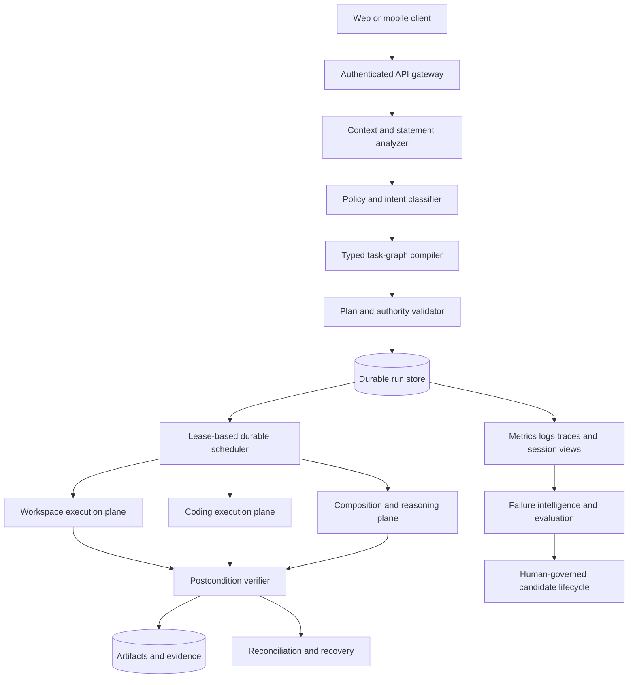
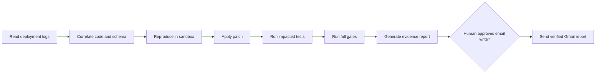
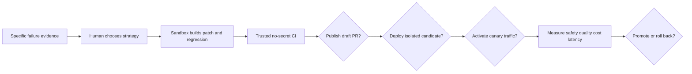
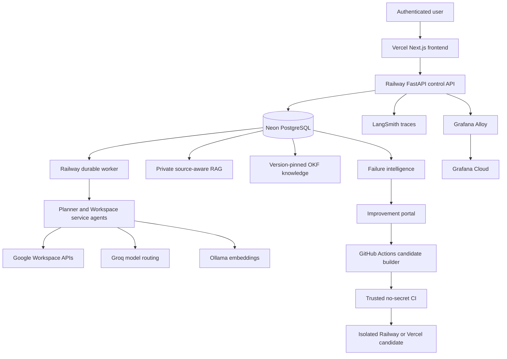
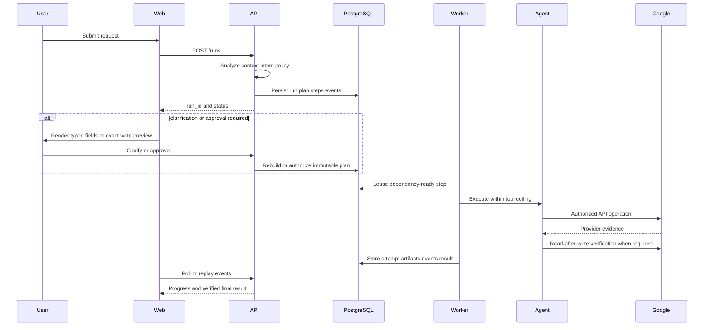

# Production Agentic AI System Design

This guide teaches system design for production agentic AI systems and then applies
the same framework to Google Connector App. It distinguishes what the repository
actually runs today from proposed future capabilities.

Related project references:

- [Current architecture](ARCHITECTURE.md)
- [Candidate threat model](CANDIDATE_THREAT_MODEL.md)
- [Operations](OPERATIONS.md)
- [Privacy and learning](PRIVACY_AND_LEARNING.md)
- [Agentic DSA and OKF](TEACHING_AGENTIC_DSA_OKF.md)

## 1. What system design means

System design is the process of turning a product objective into cooperating
components with explicit contracts, capacity limits, failure behavior, security
boundaries, and operating procedures.

An agent demo is usually optimized for the happy path:

```text
prompt -> model -> tool -> answer
```

A production agentic system must instead answer:

```text
Who is authorized?
What did the user actually request?
Which facts are authoritative?
What plan is allowed?
Which side effects may occur?
How is every result verified?
What survives a crash or disconnect?
How is an uncertain write reconciled?
How is the exact failure observed and improved?
```

The model is therefore one component inside a larger distributed system. It is not
the system's database, job queue, authorization layer, transaction manager, or proof
of completion.

## 2. Begin with requirements

### 2.1 Functional requirements

Functional requirements describe what users can accomplish. For an agentic Workspace
and coding platform, examples include:

- Search and modify supported Google Workspace resources.
- Compose content and deliver it through an explicitly selected service.
- Understand bounded conversational references.
- Plan multi-service dependency graphs.
- Inspect a connected code repository.
- Reproduce a software failure in an isolated environment.
- Patch, test, explain, and optionally publish a fix.
- Continue long work after the browser disconnects.
- Resume safely after a worker or provider failure.
- Show progress, evidence, artifacts, costs, and approvals.

### 2.2 Non-functional requirements

Non-functional requirements determine whether the product is safe and operable:

- Availability: requests can be created and inspected during normal service health.
- Durability: accepted work is not lost when a process dies.
- Correctness: completion is based on postconditions, not persuasive prose.
- Isolation: one tenant cannot access another tenant's data, runs, or credentials.
- Security: tools receive least privilege and untrusted content has no authority.
- Latency: simple operations avoid unnecessary planning, RAG, and model calls.
- Scalability: workers and tool quotas have explicit bounded concurrency.
- Observability: every stage emits correlated metrics, events, logs, and traces.
- Recoverability: backups, idempotency, reconciliation, and rollback are exercised.
- Evolvability: schemas and deployments remain compatible during gradual rollout.

### 2.3 Service-level objectives

Production teams convert vague words such as “fast” and “reliable” into SLOs. A
possible starting set, which must be adjusted after baseline measurement, is:

| Measurement | Example objective |
|---|---:|
| Run-creation availability | 99.9% per month |
| Read-only simple-task success | at least 99% on the validated capability set |
| Verified write correctness | at least 99.9%, with zero known false-success claims |
| Run creation latency | p95 below 1 second |
| Progress freshness while running | heartbeat no older than 15 seconds |
| Recovery point objective | no loss of committed run/event records |
| Recovery time objective | restore the durable control plane within an agreed window |

An SLO is an engineering target, not a guarantee that every external provider will
succeed. A production agent must report external impossibility truthfully.

## 3. Reference architecture



The most important principle is separation of concerns. Each component should do one
kind of work and communicate through typed, versioned contracts.

## 4. Control plane and execution planes

### 4.1 Control plane

The control plane owns identity, policy, planning, durable state, scheduling, version
selection, approvals, and routing. It decides what may execute but should not contain
every provider-specific implementation.

### 4.2 Workspace execution plane

The Workspace plane contains Gmail, Drive, Docs, Sheets, Calendar, Meet, Chat, Tasks,
and Contacts adapters. Each operation has a typed request, typed compact result,
idempotency rules, quota policy, and verifier.

### 4.3 Coding execution plane

A production coding plane should run in isolated ephemeral workspaces. It owns
repository indexing, bounded file operations, command execution, process tracking,
logs, tests, database development tools, diffs, and patch evidence. It must not run
inside the Workspace API process or inherit Google OAuth credentials.

### 4.4 Composition and reasoning plane

Composition produces drafts, summaries, translations, explanations, and other
bounded content. It does not gain external-write authority merely because a previous
message mentioned a destination. Delivery is a separate typed step.

## 5. The typed task graph

A natural-language instruction should compile to a directed acyclic graph rather than
an unstructured loop.



Every graph node should declare:

- Stable node and operation identifiers.
- Typed arguments and output schema.
- Dependencies.
- Preconditions and postconditions.
- Read/write and reversibility classification.
- Required authorization and approval.
- Timeout, retry, and compensation rules.
- Resource and token budgets.
- Expected artifacts and verification method.
- Executor, policy, model, tool, and OKF versions.

The graph is also the basis for progress calculation. Progress should represent
verified weighted outcomes, not the number of model messages produced.

## 6. Durable execution

HTTP requests are temporary; jobs must not be. A durable flow is:

```text
POST request
-> validate and persist run
-> return run ID quickly
-> worker leases eligible step
-> heartbeat while executing
-> append evidence events
-> commit result or failure
-> client reconnects and replays events
```

A database-backed queue using `FOR UPDATE SKIP LOCKED` is appropriate at moderate
scale because it keeps scheduling and run state transactional without introducing
another data system. At larger scale, a dedicated queue may be introduced, while
PostgreSQL remains the source of truth.

Key durability concepts:

- Lease: temporary ownership of a job by one worker.
- Heartbeat: proof that the lease owner remains alive.
- Idempotency key: stable identity for a logically repeated request.
- Append-only event: immutable evidence of a transition.
- Checkpoint: enough state to resume without repeating completed work.
- Reconciliation: inspection of provider state after an uncertain outcome.
- Compensation: an authorized corrective action, not an automatic blind undo.

## 7. Truthful completion

An LLM response is not proof that a tool ran. Completion requires a contract:

```text
expected operation
AND expected tool attempt
AND provider success evidence
AND required artifact
AND read-after-write or deterministic postcondition
= verified completion
```

If a provider returns success but the expected artifact cannot be read back, the system
should report uncertainty or partial completion. It must not silently repeat a write.

Useful separate percentages are:

- Technical completion: required nodes successfully completed.
- Functional completion: requested outcomes actually exist.
- User-visible completion: deliverables accessible to the user.
- Side-effect integrity: no incorrect, duplicate, or uncertain mutations remain.

## 8. Context, RAG, live state, and OKF

These are different information channels:

| Channel | Purpose | Example |
|---|---|---|
| Current statement | Authority and immediate intent | “Send this through Chat” |
| Bounded conversation context | Resolve recent references | “Send the paragraph above” |
| Live API | Current authoritative resource state | Latest Gmail message |
| Private user RAG | Historical semantic discovery | Related Drive documents |
| OKF | Trusted operational knowledge | Tool policy and recovery runbook |

Recent conversation context should not be embedded and retrieved when an exact recent
reference is available. Live state should not be replaced by potentially stale RAG.
OKF must never be mixed with untrusted user documents or used to grant permissions.

Every selected knowledge item should carry source, owner, ACL, content hash, chunker
version, embedding version, OKF bundle version, and retrieval evidence.

## 9. Model and tool responsibilities

Use deterministic code when inputs and rules are known:

- Authentication and authorization.
- Date, timezone, recipient, and identifier validation.
- Idempotency and deduplication.
- Dependency scheduling.
- Schema validation.
- File hashing and patch application.
- Compilation and test execution.
- Postcondition verification.
- Quota and budget enforcement.

Use an LLM when semantic judgment is genuinely needed:

- Ambiguous intent analysis.
- Novel plan generation within a tool ceiling.
- Cross-file diagnosis from selected evidence.
- Drafting or transformation.
- Comparing plausible repair strategies.

A small model becomes more useful when deterministic tools narrow its decisions. It
does not become perfectly reliable for arbitrary novel software work. High-risk,
low-confidence, or architecturally broad tasks require escalation and verification.

## 10. Safe coding-agent execution

### 10.1 Repository map

Do not send an entire repository to the model. Build an incremental map:

```text
files and hashes
-> language parsers
-> symbols and references
-> imports and dependency graph
-> runtime entry points
-> tests and ownership
-> configuration and deployment surfaces
```

Retrieve exact symbols and their test neighborhoods for each task. Re-index only files
whose hash changed.

### 10.2 File tools

Preferred file mutations are atomic typed operations or patch application. A shell
heredoc ending in `EOF` and `cat > file` are text-entry mechanisms, not safety models.
Production tools should validate paths, expected hashes, size, encoding, diff, and
rollback content.

### 10.3 Command broker

Commands should be structured as program plus argument array, working directory,
environment profile, time and resource limits, and network policy. Raw interpolated
shell strings should be exceptional and separately authorized.

### 10.4 Process registry

Every long process needs durable ownership and observability:

- Run ID, workspace ID, PID and process group.
- Command digest and working directory.
- Ports and health endpoint.
- Start, heartbeat, exit, and restart timestamps.
- Bounded stdout/stderr plus full log artifacts.
- Termination and cleanup authority.

### 10.5 Database broker

Separate schema inspection, read-only analysis, dumps, migrations, and production
writes. A production migration requires a compatible expansion plan, backup, dry-run,
transaction policy, validation query, rollback or forward-repair plan, and approval.

### 10.6 Sandbox

Each coding run should receive an ephemeral non-root container or micro-VM with CPU,
memory, disk, process, and time limits. Network is denied by default. Credentials are
short-lived capabilities scoped to one operation. Production OAuth and deployment
secrets never enter an untrusted code-generation sandbox.

## 11. Observability

Use different stores for different cardinality and retention needs:

- Prometheus/Grafana: aggregate counters, rates, histograms, queues, health, alerts.
- PostgreSQL/Neon: session, run, step, artifact, approval, and incident facts.
- LangSmith or OpenTelemetry traces: model and agent spans.
- Object/artifact storage: large bounded logs, reports, patches, dumps, and test output.

Every signal should share correlation identifiers:

```text
tenant_id -> session_id -> run_id -> step_id -> attempt_id -> artifact_id
```

Do not place email addresses, message bodies, file contents, raw prompts, OAuth tokens,
or other high-cardinality private values in Prometheus labels.

## 12. Security model

Production agent security is capability based:

- Identity establishes the user.
- Policy establishes permitted operations.
- A task graph establishes requested operations.
- A tool ceiling establishes callable tools.
- A short-lived capability authorizes one executor action.
- Postconditions establish what actually happened.

Important threats include prompt injection in retrieved content, cross-tenant access,
command injection, path traversal, secret exfiltration, dependency confusion, malicious
tests, network pivoting, duplicated writes, and forged CI/deployment evidence.

Security enforcement belongs in code and infrastructure. OKF can explain a policy but
cannot override it.

## 13. Deployment and change management

Use expand-and-contract migrations and immutable versions:

```text
backward-compatible schema expansion
-> deploy dual-compatible code
-> backfill
-> switch reads
-> verify
-> remove obsolete structure later
```

A governed improvement lifecycle is:



Automation can diagnose, reproduce, patch, test, and assemble evidence. Human gates
remain appropriate before external publication, production connectivity, real-user
canaries, policy changes, and promotion.

## 14. Evaluation

Agent evaluation must cover more than final prose:

- Intent and service classification.
- Plan completeness and dependency order.
- Tool choice and typed arguments.
- External artifact correctness.
- Verification correctness.
- False-success and false-failure rates.
- Recovery and duplicate-side-effect rate.
- Latency, tokens, API calls, and infrastructure cost.
- RAG retrieval and citation quality.
- Tenant isolation and prompt-injection resistance.
- User satisfaction and corrected trajectories.

Tests should be layered:

```text
pure unit tests
-> planner golden cases
-> mocked provider contract tests
-> database/API integration tests
-> workflow replays
-> sandbox coding tasks
-> staging smoke tests
-> selected-user canary
```

## 15. Capacity and scaling method

Estimate workload before selecting infrastructure. Let:

- `R` be requests per second.
- `S` be average steps per request.
- `L` be average step latency in seconds.
- `C` be safe concurrency per worker.

Approximate concurrent step demand is `R * S * L`. A starting worker estimate is:

```text
workers >= ceil((R * S * L) / C) * safety_factor
```

This is only a first-order estimate. Separate limits are still needed for each Google
API, model provider, database connection pool, embedding service, user, and tenant.
Autoscaling should observe queue age and service saturation, not CPU alone.

## 16. Current Google Connector App architecture

### 16.1 Deployed shape



### 16.2 Current services

- Frontend: Next.js web application with OAuth handoff, session history, run progress,
  clarifications, approvals, artifacts, feedback, RAG status, and admin improvement UI.
- API: FastAPI authentication, run lifecycle, routing, admin, monitoring, feedback, and
  private-index endpoints.
- Durable worker: PostgreSQL lease-based scheduling, dependency execution, heartbeat,
  retries, reconciliation, verification, and finalization.
- Workspace agents: Gmail, Calendar, Drive, Docs, Sheets, Tasks, Chat, Contacts, Meet.
- Model layer: Groq-hosted planning/execution models with bounded fallback policies.
- Data layer: local PostgreSQL for development and Neon PostgreSQL for production.
- Retrieval: tenant-scoped source-aware Gmail/Drive/Docs/Sheets/Chat/Calendar/Meet
  chunking and hybrid retrieval, with Ollama embeddings.
- Operational knowledge: validated versioned OKF bundle separate from private RAG.
- Observability: Prometheus-format metrics, Grafana Cloud through Alloy, LangSmith
  model traces, and PostgreSQL session dashboards.
- Improvement system: granular incidents, two strategy choices, candidate builder,
  trusted CI, isolated canary, measurement, promotion, and rollback records.
- Delivery: Railway backend/worker/candidate services, Vercel control and preview
  frontends, GitHub Actions validation/deployment workflows.

### 16.3 Current request flow



### 16.4 Current quality assessment

The current architecture is stronger than a normal prototype because durability,
tenant isolation, write approval, verification, observability, rollback, and governed
improvement are already first-class concerns.

It is suitable for a controlled production pilot of the explicitly tested Workspace
capability set. It is not yet a general production-grade autonomous platform because:

- Natural-language coverage still exposes semantic edge cases.
- Provider and OAuth capability gaps can leave partial workflows.
- Some production behavior has required fixes after live discovery.
- RAG and policy alternatives need more representative user evidence.
- Candidate generation is safe but does not yet converge reliably or cheaply.
- The candidate builder cannot execute commands or reproduce failures interactively.
- There is no general coding-agent sandbox, process registry, or database broker.
- Load, disaster recovery, penetration, and long-duration canary evidence are not yet
  sufficient to claim broad enterprise readiness.
- Portal lifecycle information is functional but too dense for a growing history.

### 16.5 Current design scorecard

These ratings describe architectural maturity, not a contractual certification:

| Dimension | Current level | Main reason |
|---|---|---|
| Durable orchestration | Strong | Persisted runs, steps, events, leases and resume |
| Workspace safety | Strong foundation | Approvals, idempotency and verification exist |
| Workspace coverage | Moderate | Many operations exist; arbitrary phrasing/combinations remain open-ended |
| Multi-user isolation | Strong foundation | Tenant-scoped runs, credentials and RAG |
| Observability | Strong foundation | Metrics, traces and durable session evidence |
| Retrieval | Moderate | Source-aware implementation exists; production evaluation is incomplete |
| Improvement governance | Strong design | Human gates, CI evidence and isolated canary |
| Candidate coding ability | Early-to-moderate | Bounded patch tools, no executable coding sandbox |
| General coding agent | Not implemented | No terminal/process/database execution plane |
| Enterprise production proof | Incomplete | More load, security, restore and canary evidence needed |

## 17. How the existing services should improve

### API and planner

- Replace prompt-label-dependent clarification lookup with semantic typed field IDs.
- Version request-analysis, plan, tool, verifier, and context contracts explicitly.
- Validate semantic-frame coverage before persisting the plan.
- Store why each service and operation was selected or omitted.
- Compile cross-domain operations into one typed DAG.

### Worker

- Add per-service and per-tenant concurrency governors.
- Make lease, cancellation, and shutdown behavior chaos-testable.
- Store resumable executor checkpoints for long non-Workspace operations.
- Separate small task workers from resource-heavy coding sandboxes.

### Workspace tools

- Generate typed adapters from provider schemas where practical.
- Maintain a capability matrix of supported scopes, operations, and verifiers.
- Expand deterministic composite operations without phrase-specific branching.
- Add contract tests for permission, quota, 404, partial and uncertain responses.

### RAG

- Complete per-user source-aware reindexing.
- Establish labelled retrieval datasets and permission-leak gates.
- Keep live-state operations outside RAG.
- Version chunking, embeddings, ranking, packing, and citations independently.

### OKF

- Add coding conventions, tool contracts, database policy, deployment procedures, and
  incident runbooks.
- Pin an immutable OKF bundle to every run and candidate.
- Require citations when OKF materially affects a plan.
- Keep executable authority in code, never in Markdown.

### Candidate builder

- Reuse a common safe coding engine.
- Add reproduction fixtures, AST edits, command/test feedback, and patch impact tools.
- Enforce source-reading and behavioral-test prerequisites before generation expands.
- Target sub-10k-token localized builds, without claiming that arbitrary large changes
  can always fit that budget.

### Improvement portal

- Use collapsible newest-first failure and candidate cards.
- Render created, updated, eligible, completed, and decision timestamps with timezone.
- Add source run/session/deployment links.
- Add a persistent highlighted action-required queue below the candidate ledger.
- Show a phase timeline and the next exact human or automatic action.
- Collapse terminal and historical items by default.

### Coding plane

- Introduce ephemeral workspaces, incremental repository maps, typed file tools,
  command/process/log brokers, database tools, tests, evidence, and cleanup.
- Never place an unrestricted host shell or production secrets in the model process.

## 18. Production-readiness review checklist

Before broad rollout, reviewers should be able to answer yes to all applicable items:

- Are product boundaries and unsupported operations explicit?
- Does every write have idempotency and an operation-specific verifier?
- Can a browser, worker, provider, or deployment fail without losing durable state?
- Can every partial write be reconciled without blind repetition?
- Are cross-tenant and prompt-injection tests present?
- Are model, tool, policy, prompt, chunker, embedding, OKF, and deployment versions
  attributable to each run?
- Are high-cardinality private values absent from metrics labels?
- Are logs, prompts, tool results, dumps, and patches retained and redacted by policy?
- Have backup restoration and migration rollback been exercised?
- Have load, quota exhaustion, network failure, and worker restart been simulated?
- Does the portal show the next required human action unambiguously?
- Do canary metrics automatically stop assignment after a safety regression?
- Is false success measured and treated as a release-blocking defect?

## 19. Glossary

**Agent** — A component that uses state, policy, models, and tools to pursue a bounded
objective. An agent is not automatically autonomous or authorized.

**Artifact** — A durable result such as a Sheet, email, Chat message, Calendar event,
patch, report, database dump, or test log.

**Capability** — Permission to perform a specific operation on a specific resource,
usually with a limited lifetime and scope.

**Canary** — A candidate version exposed to a small stable cohort before promotion.

**Compensation** — A deliberate corrective operation for an earlier side effect.

**Control plane** — The components that decide identity, policy, plans, versions,
scheduling, approvals, and routing.

**Data plane or execution plane** — The components that perform authorized work.

**DAG** — A directed acyclic graph. Dependencies point forward and contain no cycle,
allowing safe ordering and bounded parallelism.

**Durability** — The property that acknowledged state survives process failure.

**Evidence** — Structured proof that a decision, tool call, artifact, verification, or
deployment occurred.

**Idempotency** — Repeating the same logical request produces no additional unintended
effect.

**Lease** — Time-limited ownership of work, renewed by heartbeat and recoverable after
expiry.

**OKF** — Open Knowledge Format: versioned human-readable operational knowledge. In
this project it is trusted separately from private user RAG.

**Postcondition** — A statement that must be true after an operation for it to count as
successful.

**Precondition** — A statement that must be true before an operation may begin.

**RAG** — Retrieval-augmented generation: selecting relevant indexed evidence and
supplying it to a model. It does not replace live APIs or authorization.

**Reconciliation** — Determining real external state after a failed or uncertain local
attempt.

**Recovery point objective (RPO)** — The maximum acceptable amount of data loss.

**Recovery time objective (RTO)** — The target time to restore an unavailable system.

**Saga** — A sequence of distributed operations with explicit compensations where a
single atomic transaction is impossible.

**Sandbox** — An isolated, resource-limited environment that contains untrusted code
and restricts files, processes, network, and credentials.

**SLO** — A measurable service-level objective used to operate and improve the system.

**Typed lineage** — A recorded, validated relationship connecting one step's exact
output to a dependent step's input.

**Verifier** — Deterministic logic that checks operation-specific postconditions.

**Version pinning** — Binding a run to immutable executor, policy, tool, model, prompt,
retrieval, OKF, and deployment versions so its behavior is attributable and resumable.

